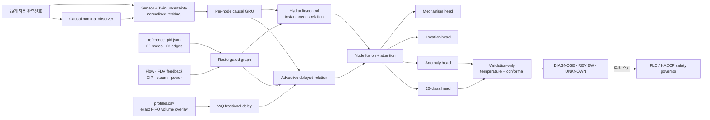
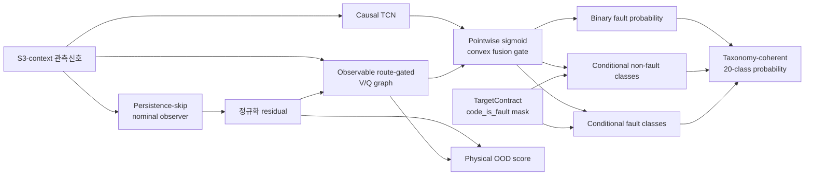

# FlowTwin-Guard

> 모델 연산자 버전: `0.1.0` · benchmark protocol: `0.2.0` · runner: `0.3.0`
> 상태: 동결 16-variant 프로토콜 구현 + 별도 W96·1-seed opened-D2 v0.3 post-hoc 개발 평가 완료; **합성 pre-validation 연구모델**
> 별도 개발 후보: `flowtwin_hybrid_v03_dev` / candidate contract `0.1.0`; **동결된 v0.2 16-variant registry에는 포함되지 않음**
> 안전 경계: 모델 출력은 PLC/HACCP를 대체하지 않으며 `SAFE` 또는 `RELEASE`를 출력하지 않는다.

FlowTwin-Guard의 논문용 전체 이름은 다음과 같다.

> **FlowTwin-Guard: Route-Conditioned Transport-Delay Graph Learning with Counterfactual Digital-Twin Residuals for HTST Fault Diagnosis**

단순히 P&ID를 정적 adjacency로 사용하는 것이 아니라, 관측 가능한 FDV feedback·CIP relay·유량·전원·steam 신호에 따라 매 시점 활성 edge를 바꾸고, 온도·조성 신호에는 profile별 체적/유량 지연을 적용한다. 압력·유량·명령은 동일한 지연을 잘못 적용하지 않고 별도 instantaneous relation으로 전달한다.

## 구현 구조



코드 경계는 다음과 같다.

| 파일 | 역할 |
|---|---|
| `flowtwin_guard/graph.py` | P&ID allowlist adapter, feature-node mapping, route gate 계약, profile별 exact FIFO overlay |
| `flowtwin_guard/data.py` | profile split을 보존하는 streaming window, counterfactual pairing, train-only scaling, target 분리 |
| `flowtwin_guard/cache.py`, `build_flowtwin_cache.py` | episode materialization, dataset/split/source checksum과 train-only scaler를 묶은 fail-closed cache |
| `flowtwin_guard/model.py` | causal Observer, fractional delay, dual-relation GNN, 계층 head와 학습 loss |
| `flowtwin_guard/hybrid.py` | persistence-skip Observer, causal TCN, route-gated `V/Q` graph와 taxonomy-coherent gated fusion 개발 후보 |
| `flowtwin_guard/alarm.py` | validation-only hysteresis·persistence·cooldown 운전 경보 선택과 profile별 제약 감사 |
| `flowtwin_guard/baselines.py` | TCN, causal Transformer, static P&ID-GNN, learned dynamic GNN, Twin-residual TCN |
| `flowtwin_guard/dspr.py` | 가장 가까운 선행연구 DSPR의 causal diagnostic adaptation; exact reproduction은 아님 |
| `flowtwin_guard/ablation.py` | 등록된 9개 single-axis ablation |
| `flowtwin_guard/conformal.py` | counterfactual-group/observable-mode block-max calibration, finite-sample corrected quantile, fail-closed abstention |
| `flowtwin_guard/metrics.py` | class/event/false-alarm/latency/selective/OOD 지표와 `not_applicable` 계약 |
| `fault_asset_contract.json` | 20개 canonical class의 location/mechanism 계층 target |
| `train_flowtwin_guard.py` | Observer 사전학습부터 test artifact 발행까지의 원자적 CLI |
| `flowtwin_benchmark_contract.json` | 16개 variant, 3 seeds, fixed budget, 지표·집계·tier의 동결 계약 |
| `flowtwin_v03_candidate_contract.json` | 이미 열린 D2에 결박된 post-hoc v0.3 개발 후보·W96·경보 계약과 주장 경계 |
| `run_flowtwin_benchmark.py` | v0.2 protocol/registry를 보존하며 train→validation-only calibration→test firewall, opt-in v0.3 candidate를 실행하는 runner `0.3.0` |
| `tests/test_flowtwin_guard.py` | 지연·경로·인과성·누수·conformal·CLI 회귀시험 |

## 공정 지연 계약

모든 `reference_pid.json` holdup을 simulator truth로 취급하지 않는다. 실제 simulator FIFO와 P&ID prior를 명시적으로 구분한다.

| 구간 | 모델에서 사용한 체적 | 상태 |
|---|---:|---|
| `HX-101-B → HT-101` | `nominal_flow × nominal_holding_time` | profile별 simulator-exact FIFO |
| `P-102 → FDV-101` | `nominal_flow × sensor_to_fdv_delay` | profile별 simulator-exact FIFO |
| `FDV-101 → PRODUCT-OUTLET` | `nominal_flow × post_fdv_residence_time` | profile별 aggregate exact FIFO를 L-008~010에 prior 비율로 분배 |
| `FDV-101 → TK-101` | 1 simulation step | simulator-exact return timing |
| 기타 material line | P&ID `nominal_holdup_l` | nominal prior, 최대 ±25% bounded correction |
| CIP L-201~203 | P&ID prior | simulator의 perfect-mix inventory를 근사; exact FIFO 주장 금지 |
| utility/control | `0 s` relation | 유체 수송지연을 적용하지 않음 |
| drain 및 개별 alkali/acid dosing | gate `0` | D1에 명령신호가 없어 경로를 임의 생성하지 않음 |

advective edge의 시변 지연은 다음과 같다.

```text
tau_e(t) = V_e(profile) / (measured_flow(t) / 3600)
```

fractional sample은 선형보간하고 window 이전을 참조하면 첫 값을 복제하지 않고 `valid=false`, zero message로 처리한다. 유량이 1 L/h 이하이면 material gate가 닫힌다.

## 관측 route gate

다음 여섯 신호만 경로 계산에 사용한다.

```text
measured_flow_l_h
cip_cycle_active
fdv_position_feedback
steam_valve
power_good_signal
cip_chemical_concentration_pct
```

`plant_mode`, fault/scenario ID, 실제 `fdv_position`, `fdv_actual_forward`, routing volume과 alarm은 사용하지 않는다. FDV command가 forward여도 feedback이 divert이면 forward edge는 닫히고 divert edge가 열린다. CIP relay가 켜지면 생산 forward/divert 분기는 모두 닫고 CIP return을 연다.

## Nominal Twin residual과 불확실성

Observer는 현재 관측을 입력받아 그대로 복사하지 않는다. 시점 `t`의 정상 예측은 `t-1`까지의 관측만 사용하는 causal GRU에서 나온다.

```text
r_i(t) = (x_i(t) - xhat_i,normal(t))
         / sqrt(sigma_twin_i(t)^2 + sigma_sensor_i^2)
```

- Observer는 train-ID의 `N00`, `M01`, `M02` healthy mode만으로 먼저 학습하고 이후 freeze한다.
- `sigma_twin`은 Observer Gaussian NLL의 학습분산이다.
- `sigma_sensor`는 `sensor_catalog.json`에 실제 synthetic uncertainty budget이 있는 TT-104, FT-101, PDT-101, AIT-201/202/203 여섯 계측에만 넣는다.
- catalog가 없는 23개 신호에 교정값을 임의로 만들지 않으며 graph artifact의 `sensor_uncertainty_known` mask로 공개한다.
- scaling 통계는 `train_id`에서만 계산한다.

동일 counterfactual group 안의 일반 고장은 N00과 pairing하고, F12 `incomplete_cleaning`만 M02 `cip_cycle`과 pairing한다. pairing metadata와 oracle label은 loss target 구성에만 쓰며 모델 입력 tensor에 들어가지 않는다.

## 학습 목적

총 loss는 다음 항을 사용한다.

```text
L = L_class
  + 0.50 L_anomaly
  + 0.25 L_location
  + 0.25 L_mechanism
  + 0.10 L_counterfactual
  + 0.01 L_transport
  + 0.001 L_delay-prior
```

- 네 supervised head는 train-only inverse-square-root class weight와 focal loss를 사용한다.
- counterfactual loss는 효과 전/정상 representation을 reference에 가깝게 하고 관측 가능한 고장구간을 margin 이상 분리한다.
- transport consistency는 정상구간의 활성 advective edge만 대상으로 한다.
- nominal P&ID delay correction은 bounded regularization을 받으며 exact FIFO delay는 보정하지 않는다.
- 모든 supervised, transport, counterfactual loss는 `valid_mask & eval_mask`에서만 계산한다. `valid_mask`는 causal context/padding 유효성, `eval_mask`는 overlapping window에서 한 row가 중복 loss로 계산되지 않게 하는 owning region을 표시한다.
- Event-aware train sampler는 onset/middle/end landmark를 단순히 window context에 넣지 않고 반드시 해당 window의 `eval_mask=true` loss region에 배치한다. 학습 전에 non-`N00` target-bearing episode가 적어도 하나의 target row를 owning region에 보존하지 못하면 실행을 중단한다.
- validation-ID에서 class temperature와 anomaly threshold를 고정한다. Conformal/OOD calibration item은 독립 row로 간주하지 않고 **counterfactual group × observable production/CIP mode** block별 true-class nonconformity/ID energy 최대값으로 축약한다.
- 이 conformal 결과는 합성 row에서 관찰한 empirical coverage만 보고한다. D1 validation은 profile 2개뿐이므로 미지 profile shift에 대한 finite-sample coverage guarantee를 주장하지 않는다.
- test-ID/OOD label은 calibration에 사용하지 않는다.

## 실행

공정 simulator는 계속 Python 표준 라이브러리만 필요하다. FlowTwin-Guard만 별도 ML 환경을 사용한다.

```bash
python3.12 -m venv .venv
.venv/bin/pip install -r requirements-ml.txt
```

D1-pilot 생성·분할·감사를 먼저 수행한다.

```bash
python3 generate_ml_dataset.py \
  --output ml_datasets/D1-pilot \
  --dataset-version D1-pilot \
  --profiles 12 \
  --ood-profiles 0 \
  --replicates 5 \
  --duration-s 1800 \
  --dt-s 0.5 \
  --seed 20260725

python3 split_ml_dataset.py \
  --dataset ml_datasets/D1-pilot \
  --output ml_datasets/D1-pilot-splits \
  --seed 20260725 \
  --train-ratio 0.60 \
  --validation-ratio 0.20

python3 audit_ml_dataset.py \
  --dataset ml_datasets/D1-pilot \
  --splits ml_datasets/D1-pilot-splits \
  --report ml_results/D1-pilot-audit.json

.venv/bin/python build_flowtwin_cache.py \
  --dataset ml_datasets/D1-pilot \
  --splits ml_datasets/D1-pilot-splits \
  --output ml_datasets/D1-pilot-cache-v0.3 \
  --feature-set S3-context
```

`D1-pilot-cache-v0.3/cache_manifest.json`은 dataset/split manifest SHA-256, 각 원본 `checksums.sha256`의 SHA-256, 1,200개 episode materialization, train-only scaler, feature/target/array contract, 그리고 `ml_pipeline_common.py`를 포함해 materialization에 쓴 전체 source SHA-256을 묶는다. Loader는 cache 자체 checksum 뿐 아니라 현재 dataset·split·graph·target·source와의 일치를 확인하므로, 예전 cache를 묵시적으로 재사용할 수 없다.

등록된 전체 행렬은 FlowTwin-Guard 1개, baseline 6개, ablation 9개의 **16개 variant×3 seeds**다. Frozen v0.2 budget의 D1 ID-only full pilot을 다음과 같이 실행한다.

```bash
.venv/bin/python run_flowtwin_benchmark.py \
  --dataset ml_datasets/D1-pilot \
  --splits ml_datasets/D1-pilot-splits \
  --cache ml_datasets/D1-pilot-cache-v0.3 \
  --contract flowtwin_benchmark_contract.json \
  --output ml_results/FlowTwin-Benchmark-D1-v0.2-full \
  --variants all \
  --seeds 20260727 20260728 20260729 \
  --window-size 64 \
  --stride 32 \
  --train-windows-per-episode 12 \
  --batch-size 32 \
  --observer-epochs 3 \
  --epochs 10 \
  --hidden-dim 32 \
  --observer-hidden-dim 48 \
  --layers 2 \
  --attention-heads 4 \
  --dropout 0.1 \
  --learning-rate 0.001 \
  --weight-decay 0.0001 \
  --alpha 0.1 \
  --ood-alpha 0.01 \
  --device cpu \
  --save-predictions
```

코어 경로만 빠르게 점검하는 reduced development run은 다음과 같다. 제안모델, temporal baseline, 가장 가까운 선행연구 adaptation만 남기고 seed·window budget·epoch을 줄였으므로, runner가 반드시 `development`로 표시하며 이 결과는 논문 성능 결론에 사용하지 않는다.

```bash
.venv/bin/python run_flowtwin_benchmark.py \
  --dataset ml_datasets/D1-pilot \
  --splits ml_datasets/D1-pilot-splits \
  --cache ml_datasets/D1-pilot-cache-v0.3 \
  --contract flowtwin_benchmark_contract.json \
  --output ml_results/FlowTwin-Benchmark-D1-core-dev-v0.3 \
  --variants flowtwin_guard tcn dspr_diagnostic_adaptation \
  --seeds 20260727 \
  --window-size 32 \
  --stride 32 \
  --train-windows-per-episode 4 \
  --batch-size 64 \
  --observer-epochs 1 \
  --epochs 1 \
  --hidden-dim 16 \
  --observer-hidden-dim 24 \
  --layers 1 \
  --attention-heads 4 \
  --dropout 0.1 \
  --learning-rate 0.001 \
  --weight-decay 0.0001 \
  --alpha 0.1 \
  --ood-alpha 0.01 \
  --device cpu
```

출력 디렉터리는 비어 있어야 하며 실패 시 부분 결과를 publish하지 않는다. `--train-windows-per-episode 12`는 train label에서만 확인한 비정상 target의 onset/middle/end landmark를 **해당 window의 `eval_mask` loss region**에 먼저 넣고, 남은 슬롯을 전체 시간축에 결정적으로 분산한다. 현재 D1에서는 700개 train episode 중 target-bearing 650개가 8,400개 window에 모두 포함되고 누락은 0개다. Validation/test에는 cap을 적용하지 않고 `valid_mask & eval_mask`로 모든 행을 정확히 한 번 평가한다.

| 산출물 | 내용 |
|---|---|
| `benchmark_contract.json`, `benchmark_config.json` | frozen contract와 실제 variant/budget/device/tier |
| `training_coverage_audit.json`, `target_weights.json` | target-bearing sampling coverage와 exhaustive train-only class weight |
| `standardizer.json`, `graph_contract.json`, `split_domain_audit.json` | train-only scaling, graph, ID/OOD domain 감사 |
| `runs/<variant>__seed-<seed>/model.pt` | variant config와 strict state dictionary |
| `runs/.../training_history.json`, `calibration.json` | Observer/diagnosis loss와 validation-only block calibration |
| `runs/.../metrics.json`, `run_record.json` | overall/split/profile 지표, 효율, artifact hash |
| `runs/.../test_predictions.npz` | `--save-predictions`일 때만 발행하는 paired downstream 분석용 압축 row |
| `benchmark_results.json` | 16개 variant×seed 결과와 profile-cluster paired bootstrap |
| `run_manifest.json` | split 정책, 입력 계약, tier, 환경, source/input/cache checksum |
| `checksums.sha256` | 전체 artifact 무결성 |

### D2 synthetic OOD 개발 set

`ml_datasets/D2-ood-dev` 생성·split·감사는 완료됐다. ID 12 + OOD 4 = 16 profiles, 48 counterfactual groups, 960 episodes, signal/label 각 1,728,000 rows이며 train 7/420, validation 2/120, test-ID 3/180, test-OOD 4/240 profiles/episodes로 나뉘다. OOD는 `OOD_LOW_FLOW` 2 profiles와 `OOD_HIGH_FLOW_WARM_FEED` 2 profiles이다. 다음 명령의 결과가 감사 30/30을 통과했다.

```bash
python3 generate_ml_dataset.py \
  --output ml_datasets/D2-ood-dev \
  --dataset-version D2-ood-dev \
  --profiles 12 \
  --ood-profiles 4 \
  --ood-contract ood_profile_contract.json \
  --replicates 3 \
  --duration-s 900 \
  --dt-s 0.5 \
  --seed 20260731

python3 split_ml_dataset.py \
  --dataset ml_datasets/D2-ood-dev \
  --output ml_datasets/D2-ood-dev-splits \
  --seed 20260731 \
  --train-ratio 0.60 \
  --validation-ratio 0.20

python3 audit_ml_dataset.py \
  --dataset ml_datasets/D2-ood-dev \
  --splits ml_datasets/D2-ood-dev-splits \
  --report ml_results/D2-ood-dev-audit.json

.venv/bin/python build_flowtwin_cache.py \
  --dataset ml_datasets/D2-ood-dev \
  --splits ml_datasets/D2-ood-dev-splits \
  --output ml_datasets/D2-ood-dev-cache-v0.3 \
  --feature-set S3-context
```

Domain verifier는 단순 `domain` 문자열을 믿지 않고, `profiles.csv`의 실제 33개 physical parameter로 profile config hash를 재구성한다. 또한 모든 값이 versioned domain range에 있고 각 OOD domain이 다른 domain과 최소 한 closed interval에서 strict support gap을 갖는지 확인한다. 이 감사는 synthetic domain integrity만 증명하며 현장 OOD 타당성은 증명하지 않는다. `D2-ood-dev-cache-v0.3`도 960 episodes/1,728,000 rows와 train-only 756,000 scaling rows를 source provenance와 함께 materialize했다. 위 frozen full command의 dataset/split/cache/output 경로를 D2로 바꾸고 나머지 16-variant×3-seed budget을 그대로 유지한다.

### D2 정규-budget 3-model 개발 결과

`ml_results/FlowTwin-Benchmark-D2-core-budget-v0.2/`는 window 64, train windows/episode 12, Observer 3 epochs, diagnosis 10 epochs, hidden 32, graph 2 layers의 frozen 비시드 budget과 seed `20260727`을 사용했다. 세 모델만 선택했으므로 runner 판정은 `development`이며 전체 등록 비교가 아니다.

| 모델 | 전체/ID/OOD macro-F1 | event-F1 / recall | FA onset h⁻¹ | 경보 전 unsafe L | OOD AUROC / FPR95 | 평균 set / DIAGNOSE |
|---|---:|---:|---:|---:|---:|---:|
| FlowTwin-Guard | 0.44545 / 0.58369 / 0.40355 | 0.01872 / 0.91667 | 347.85 | 150.30 | 0.81138 / 0.95059 | 10.34 / 0 |
| TCN | 0.56266 / 0.65439 / 0.52586 | 0.03626 / 0.91092 | 169.85 | 713.01 | 0.41887 / 0.97523 | 12.60 / 0 |
| DSPR diagnostic adaptation | 0.58609 / 0.62544 / 0.57214 | 0.25665 / 0.72126 | 3.09 | 6,004.27 | 0.58005 / 0.93767 | 12.45 / 0 |

1-epoch/window-32 reduced run에서 FlowTwin macro-F1이 0.04450이었던 것과 달리 정규 budget에서는 0.44545로 회복됐다. 핵심 holding delay가 window 32에서는 유효 행의 약 0.2%에서만 활성화되지만 window 64에서는 약 80–88%로 늘기 때문에 reduced 수치는 구조 성능으로 해석할 수 없다. 그럼에도 정규 결과에서 FlowTwin은 TCN/DSPR보다 class·event 성능이 낮고 오경보가 많다. OOD AUROC 0.81138도 FPR95 0.95059를 동반하므로 실용적 open-set 성능이 아니다. 현재 방어 가능한 결론은 physics/residual branch의 OOD 가능성을 후속 ablation에서 검증할 가치가 있다는 것뿐이다.

### FlowTwin v0.3 post-hoc 개발 후보

`flowtwin_hybrid_v03_dev`는 위 D2 결과를 확인한 뒤 설계한 **post-hoc 개발 후보**다. `D2-ood-dev`의 test-ID/OOD를 후보 동결 전에 이미 열어 보았으므로, `flowtwin_v03_candidate_contract.json`은 `d2_test_seen_before_freeze=true`와 `development_only`를 강제한다. 이 후보는 `flowtwin_benchmark_contract.json` v0.2의 16개 등록 variant를 수정하지 않는다. 따라서 `--variants all`, `models`, `ablations`의 의미도 그대로이고, 후보는 전체 ID를 명시해야만 선택되며 후보가 포함된 run의 tier는 항상 `development`다.



구조와 출력 계약은 다음과 같다.

- TCN branch는 허용된 표준화 관측의 인과적 시간 패턴을 학습한다.
- Observer는 `t-1` 관측에 학습 delta를 더하는 persistence skip으로 시작한다. Delta head는 0으로 초기화되며 현재·직전 sample이 모두 유효할 때만 예측을 loss에 쓴다.
- Physics branch는 정규화 residual을 node에 투영하고, 관측 route gate와 profile별 체적·실측 유량으로 계산한 edge `V/Q` fractional delay를 적용한다.
- 시점별 sigmoid gate가 TCN과 physics embedding의 convex mixture를 만든다.
- `TargetContract.code_is_fault` mask가 fault/non-fault partition을 고정한다. `N00`, `M01`, `M02`를 포함한 non-fault 조건부 분포와 fault 조건부 분포를 binary fault probability와 조합하므로, 매 행에서 **fault class 확률합 = anomaly probability**가 성립한다.
- Physical OOD score는 `log1p(mean(normalized residual²)) + log1p(route-active transport error)`다. v0.2 logit energy와 수치적으로 호환되거나 직접 비교 가능한 score가 아니다.

후보 budget은 seed `20260727`, window 96, stride 32, train windows/episode 12, Observer 3 epochs, diagnosis 10 epochs, hidden 32, Observer hidden 48, graph/TCN layers 2로 별도 계약에 고정된다. W96과 아래 gate threshold는 D2를 살펴본 뒤 선택했으므로 prospective 선택으로 표현하지 않는다. 학습 전에 `train_id`만 열어 `valid_mask & eval_mask & measured_flow_l_h > 1 & observable route gate > 0`인 행 중 local index에서 `V/Q/dt`를 뺀 참조가 window 안에 남는 비율을 exact-FIFO edge별로 검사한다.

| edge | exhaustive valid / eligible | exhaustive coverage | sampled-train valid / eligible | sampled coverage |
|---|---:|---:|---:|---:|
| `L-005` | 695,290 / 710,694 | 0.9783254115 | 154,378 / 169,782 | 0.9092718898 |
| `L-007` | 709,278 / 710,694 | 0.9980075813 | 168,366 / 169,782 | 0.9916598933 |
| `L-008` | 461,753 / 462,581 | 0.9982100432 | 104,633 / 105,461 | 0.9921487564 |
| `L-009` | 461,645 / 462,581 | 0.9979765706 | 104,525 / 105,461 | 0.9911246812 |
| `L-010` | 461,663 / 462,581 | 0.9980154827 | 104,543 / 105,461 | 0.9912953604 |

최솟값은 exhaustive `0.9783254115`, sampled train `0.9092718898`이고 각 gate는 각각 `≥0.95`, `≥0.90`을 요구한다. 감사가 연 split은 `train_id` 하나이고 `non_train_rows_opened=0`이다. Pooled coverage는 판정값으로 쓰지 않으며, edge 하나라도 분모가 0이거나 기준에 못 미치면 학습 전에 실패한다. 계약에는 W64의 D2 train 최소 coverage가 exhaustive `0.851460685`, sampled `0.786727010`이었다는 post-hoc 선택 근거도 함께 공개한다.

후보의 확률 교정은 `validation_id`에서만 binary fault temperature와 fault/non-fault conditional class temperature를 각각 맞춘 뒤 hierarchy invariant를 다시 검사한다. 그 다음 기존 counterfactual-group×observable-mode block-max conformal을 적용한다. 운전 경보도 test를 열기 전에 validation에서만 선택하며, 같은 threshold·hysteresis·assert/clear duration·cooldown 탐색격자와 같은 profile별 false-alarm/recall 제약을 **후보 run에 선택된 모든 variant**에 적용한다. 비교 모델별 validation score가 다르므로 최종 선택 운전점은 모델별로 달라질 수 있지만, 탐색 공간과 제약은 동일하다.

기존 point-threshold 지표는 `event_detection`, `false_alarms`, `unsafe_forward_l_before_first_post_effect_alarm`에 그대로 보존한다. State-machine 경보 결과는 `operational_event_detection`, `operational_false_alarms`, `operational_unsafe_forward_l_before_first_post_effect_alarm`로 별도 기록해 후처리 효과로 원 지표를 덮어쓰지 않는다. Validation에서 profile별 최대 false-alarm-onset `≤5 h⁻¹`, 전체 event recall `≥0.8`, eligible event가 있는 각 profile recall `≥0.5`를 동시에 만족하는 운전점이 없으면 `no_operating_point`로 종료하고, **test iterator를 생성하기 전에 실패**한다. Row-threshold fallback은 허용하지 않는다.

확정된 v0.3 개발 결과는 모두 **이미 열어 본 D2에서 W96·1 seed로 실행한 post-hoc 결과**다. 후보 계약이 budget과 D2 dataset/split/cache checksum을 결박하므로 candidate·FlowTwin·DSPR shard에 budget 인자를 덮어쓰면 실패한다. 후보 shard는 다음 경로에 고정했다.

```bash
.venv/bin/python run_flowtwin_benchmark.py \
  --dataset ml_datasets/D2-ood-dev \
  --splits ml_datasets/D2-ood-dev-splits \
  --cache ml_datasets/D2-ood-dev-cache-v0.3 \
  --contract flowtwin_benchmark_contract.json \
  --candidate-contract flowtwin_v03_candidate_contract.json \
  --output ml_results/FlowTwin-v03-D2-candidate-matched-dev \
  --variants flowtwin_hybrid_v03_dev \
  --device cpu \
  --save-predictions
```

단일 4-model atomic run은 의도대로 TCN에서 `no_operating_point`로 종료된다. TCN은 validation grid 75개 중 profile FA·전체 recall·profile recall 제약을 동시에 만족하는 점이 `0`개였고, runner는 TCN test iterator를 만들기 전 전체 원자적 publish를 취소했다. 따라서 성공한 operational 모델은 같은 candidate contract로 각각 실행해 `FlowTwin-v03-D2-flowtwin-operational-dev`, `FlowTwin-v03-D2-dspr-operational-dev`에 보존했다. 아래의 `VARIANT`/`OUTPUT`을 각각 `flowtwin_guard`/`ml_results/FlowTwin-v03-D2-flowtwin-operational-dev`, `dspr_diagnostic_adaptation`/`ml_results/FlowTwin-v03-D2-dspr-operational-dev`로 대입한다.

```bash
.venv/bin/python run_flowtwin_benchmark.py \
  --dataset ml_datasets/D2-ood-dev \
  --splits ml_datasets/D2-ood-dev-splits \
  --cache ml_datasets/D2-ood-dev-cache-v0.3 \
  --contract flowtwin_benchmark_contract.json \
  --candidate-contract flowtwin_v03_candidate_contract.json \
  --output OUTPUT \
  --variants VARIANT \
  --device cpu \
  --save-predictions
```

TCN은 우선 같은 W96 budget으로 **row/class diagnostic만** `ml_results/FlowTwin-v03-D2-tcn-raw-diagnostic-dev`에 고정했다. 이 실행은 alarm gate를 건너뛰 operational 결과를 만들기 위한 우회가 아니다. 동결 checkpoint를 validation-only audit에 넘겨 `ml_results/FlowTwin-v03-D2-tcn-alarm-feasibility-dev`의 `0/75`, `test_rows_seen=0`, `test_iterator_constructed=false`를 영구 기록했다.

```bash
.venv/bin/python run_flowtwin_benchmark.py \
  --dataset ml_datasets/D2-ood-dev \
  --splits ml_datasets/D2-ood-dev-splits \
  --cache ml_datasets/D2-ood-dev-cache-v0.3 \
  --contract flowtwin_benchmark_contract.json \
  --output ml_results/FlowTwin-v03-D2-tcn-raw-diagnostic-dev \
  --variants tcn --seeds 20260727 \
  --window-size 96 --stride 32 --train-windows-per-episode 12 \
  --batch-size 32 --observer-epochs 3 --epochs 10 \
  --hidden-dim 32 --observer-hidden-dim 48 --layers 2 \
  --attention-heads 4 --dropout 0.1 --learning-rate 0.001 \
  --weight-decay 0.0001 --alpha 0.1 --ood-alpha 0.01 \
  --device cpu --save-predictions

.venv/bin/python audit_flowtwin_v03_alarm.py \
  --raw-result ml_results/FlowTwin-v03-D2-tcn-raw-diagnostic-dev \
  --dataset ml_datasets/D2-ood-dev \
  --splits ml_datasets/D2-ood-dev-splits \
  --cache ml_datasets/D2-ood-dev-cache-v0.3 \
  --output ml_results/FlowTwin-v03-D2-tcn-alarm-feasibility-dev \
  --benchmark-contract flowtwin_benchmark_contract.json \
  --candidate-contract flowtwin_v03_candidate_contract.json
```

#### 네 모델 diagnostic/row-threshold 결과

각 row threshold는 `validation_id`에서 적합했고 표의 event·FA·unsafe는 state-machine 적용 전 combined test 지표다. `전체` macro-F1은 ID/OOD row를 합친 descriptive pooled 값이지 profile-level 추론 결과가 아니다. 이 표만 네 모델 모두를 포함한다.

| 모델 | parameter | 전체 / ID / OOD macro-F1 | validation-fitted row event-F1 / recall | row-threshold FA onset h⁻¹ | row-threshold unsafe L | OOD AUROC / FPR95 |
|---|---:|---:|---:|---:|---:|---:|
| FlowTwin-Hybrid v0.3 | 58,315 | 0.56218 / **0.68129** / 0.53188 | 0.03452 / 0.92529 | 186.51 | 414.37 | 0.55268 / 0.91749 |
| FlowTwin-Guard | 42,508 | 0.42491 / 0.55566 / 0.37698 | 0.02686 / 0.92816 | 245.83 | 0.00 | **0.76773** / 0.93618 |
| TCN | 15,379 | 0.58313 / 0.64073 / 0.54890 | 0.02222 / 0.91667 | 285.31 | 56.31 | 0.45451 / 0.98143 |
| DSPR diagnostic adaptation | 54,166 | **0.59399** / 0.61125 / **0.58642** | **0.31215** / 0.80460 | **5.24** | 4,081.49 | 0.57475 / 0.93870 |

#### Validation operational feasibility

| 모델 | 유효 / 전체 후보 | 선택 on / off / assert | validation event-F1 / recall | 최소 profile recall | 최대 profile FA h⁻¹ |
|---|---:|---:|---:|---:|---:|
| FlowTwin-Hybrid v0.3 | 4 / 75 | 0.70 / 0.20 / 5 s | 0.88889 / 0.80808 | 0.79167 | 3.40089 |
| FlowTwin-Guard | 4 / 75 | 0.50 / 0.10 / 5 s | 0.89583 / 0.86869 | 0.79167 | 4.29159 |
| TCN | **0 / 75** | — | — | — | — |
| DSPR diagnostic adaptation | 8 / 75 | 0.70 / 0.05 / 2 s | 0.89362 / 0.84848 | 0.79167 | 3.88673 |

TCN은 `minimum_event_recall_not_met`, `minimum_profile_event_recall_not_met`, `profile_false_alarm_constraint_exceeded`를 아우르는 fail-closed 결과이므로 test operational 수치를 보고하지 않는다.

#### 유효 운전점을 찾은 3-model의 조건부 test 결과

| 모델 | 전체 / ID / OOD operational event-F1 | 전체 recall | 전체 / ID / OOD FA h⁻¹ | 전체 / ID / OOD unsafe L |
|---|---:|---:|---:|---:|
| FlowTwin-Hybrid v0.3 | 0.87690 / **0.90775** / 0.85841 | 0.91092 | 5.744 / 3.164 / 7.722 | 436.18 / 436.18 / 0.00 |
| FlowTwin-Guard | **0.90040** / 0.88462 / **0.91156** | **0.97414** | 7.770 / 6.710 / 8.582 | **10.51** / 10.51 / 0.00 |
| DSPR diagnostic adaptation | 0.88438 / 0.86923 / 0.89474 | 0.81322 | **3.276** / **2.883** / **3.577** | 3,674.27 / 2,118.45 / 1,555.83 |

해석은 다음 범위로 제한한다.

- Hybrid은 ID macro-F1 `0.68129`로 1위지만 전체·OOD macro-F1은 DSPR보다 낮고, operational 전체 event-F1도 FlowTwin-Guard보다 낮다. 전반적 우월성은 없다.
- Validation 최대 profile FA는 Hybrid `3.40`, FlowTwin `4.29 h⁻¹`였지만 test profile 최댓값은 각각 `9.42`, `9.09 h⁻¹`로 상승했다. `≤5 h⁻¹` 제약이 Hybrid/FlowTwin에서 일반화되지 않았다. DSPR test profile 최댓값은 `4.18 h⁻¹`였지만 전체 recall `0.81322`와 unsafe `3,674.27 L`의 trade-off가 크다.
- `F05` recall은 네 모델 모두 `0`이고 Hybrid의 `F09` recall도 `0`이다. Conformal `DIAGNOSE`는 네 모델 모두 `0`이므로 완성된 20-class 진단 시스템이 아니다.
- 실행 시간은 병렬 CPU 작업과 경합을 포함해 서로 비교하지 않는다. 여기서 비교 가능한 효율 크기 정보는 위 parameter count뿐이다.

다섯 원 산출물을 합쳐 표준 개발 보고서를 만드는 명령은 다음과 같다.

```bash
.venv/bin/python report_flowtwin_v03_development.py \
  --candidate ml_results/FlowTwin-v03-D2-candidate-matched-dev \
  --flowtwin ml_results/FlowTwin-v03-D2-flowtwin-operational-dev \
  --tcn ml_results/FlowTwin-v03-D2-tcn-raw-diagnostic-dev \
  --dspr ml_results/FlowTwin-v03-D2-dspr-operational-dev \
  --tcn-alarm-audit ml_results/FlowTwin-v03-D2-tcn-alarm-feasibility-dev \
  --output ml_results/FlowTwin-v03-D2-development-report
```

이 결과는 novelty, 우월성, external-OOD 또는 confirmatory 근거가 아니다. 논문 주장을 하려면 모델·window·경보·threshold 설계에 사용하지 않은 새 profile set을 독립적으로 생성·봉인한 뒤 한 번 평가해야 한다. 이 후보는 현장 정확도, 살균 유효성, HACCP 적합성, 제품 안전, `SAFE`/`RELEASE` 권한도 입증하지 않는다.

## 검증과 ablation

현재 자동시험은 다음을 확인한다.

- 1.5-step fractional delay의 값과 두 이웃 sample로 전달되는 `0.5/0.5` gradient
- window 이전 지연의 invalid/zero 처리
- FDV command가 아닌 feedback 기반 forward/divert gate
- CIP 중 생산 분기 차단과 CIP return 활성화
- P&ID에 존재하더라도 ML allowlist 밖인 level/inlet truth와 oracle 차단
- 미래 input을 바꿔도 과거 logits가 변하지 않는 causal forward
- 모든 hierarchy output shape, finite loss와 graph gradient
- `valid_mask & eval_mask` loss ownership, event landmark가 owning loss region에 들어가는지와 target-bearing episode 전수 coverage
- validation-ID 외 데이터의 conformal calibration 거부와 counterfactual-group/observable-mode block-max 축약
- checkpoint 재로딩 후 test artifact와 checksum 발행

논문에서는 최소한 다음 ablation을 같은 profile split과 seed로 실행한다.

1. `tau=0`: 모든 advective 지연 제거
2. fixed nominal delay: profile/flow 변화를 제거
3. static route: FDV/CIP gate 제거
4. single relation: 압력·제어에도 V/Q 지연 적용
5. raw only: nominal residual 제거
6. no uncertainty: sensor/Twin denominator 제거
7. no counterfactual loss
8. no conformal/abstention
9. status relay 제외: F13/F15 direct-status 이점 분리

등록 neural baseline 6개는 `tcn`, `causal_transformer`, `static_pid_gnn`, `dynamic_gnn`, `twin_residual_tcn`, `dspr_diagnostic_adaptation`이다. 규칙/EWMA/CUSUM은 neural 16-variant matrix와 별도의 운영 기준선으로 공동 보고한다. DSPR은 physics-residual dual stream, physics-guided dynamic graph, adaptive causal receptive window를 담은 **가장 가까운 선행연구 baseline**이다. 다만 원 논문은 multi-horizon forecasting이고 저자 구현이 공개되지 않아, 현재 코드는 논문의 식·Algorithm 1을 six-output causal diagnosis 계약에 맞춰 독립 구현한 adaptation이다. **Author-code exact reproduction이나 원 논문 성능 재현으로 표현하지 않는다.**

정적 topology GNN, 동적 topology GNN, Digital Twin+GCN은 이미 별도 연구가 있으므로 이 모델의 주 기여는 **HTST route 상태와 explicit edge `V/Q` material travel time을 결합한 dual-relation operator**로 한정한다.

관련 선행연구:

- [Topology-Guided Graph Learning for Process Fault Diagnosis](https://pubs.acs.org/doi/10.1021/acs.iecr.2c03628)
- [Industrial fault diagnosis via topology inference and feature compensation](https://www.sciencedirect.com/science/article/pii/S0957582026008219) — withdrawn, 근거에서 제외
- [Digital twin and graph transfer learning for centrifugal-pump diagnosis](https://www.sciencedirect.com/science/article/abs/pii/S0166361524000836)
- [DSPR: Dual-Stream Physics-Residual Networks for Trustworthy Industrial Time Series Forecasting](https://arxiv.org/abs/2604.07393)

체계적 문헌고찰 전에는 세계 최초라고 주장하지 않는다.

## 평가·집계·tier 계약

- 20-class macro-F1의 등록 scope는 `test_id`다. OOD row를 섞어 ID class 지표를 바꾸지 않는다.
- Event precision/recall/F1은 episode 내 observable-effect interval과 alarm interval을 chronological one-to-one로 매칭한다.
- 등록 latency endpoint는 detection 성공건만의 빠른 값이 아니라 **mean horizon-penalized latency**다. Miss에는 `effect_time_s`부터 관찰 이벤트 종료까지의 남은 horizon을 부여하며, event recall·miss count와 항상 같이 보고한다.
- 95% paired interval의 외층 추론 단위는 `plant_profile_id`이고 training seed는 technical repeat이다. Row, overlapping window, event를 독립 표본으로 세지 않는다.
- `development`는 subset/reduced/overridden run, `pilot`은 exact ID-only 행렬 또는 등록 seed subset, `protocol_complete_synthetic`은 전 16개 variant×3 seeds·exact CPU budget·검증된 `test_id`+`test_ood_profile`을 모두 갖춘 실행이다.
- `protocol_complete_synthetic`은 **합성 프로토콜 완료 label**이지 external confirmatory, 현장 검증, 제품안전 증거가 아니다. Runner의 `external_confirmatory_claim`은 항상 false이다.

## 2026-07-27 전체-class smoke 기록

저장된 `ml_results/D1-v2-smoke/`의 4 profiles×20 classes×1 replicate×120초 자료로 전체 실행경로를 고정했다. Profile split은 train 2개, validation 1개, test 1개이며 학습 설정은 Observer 3 epochs, diagnosis 20 epochs, hidden 32, Observer hidden 48, graph 2 layers, seed `20260727`이다.

결과 경로는 `ml_results/FlowTwin-Guard-v0.1-balanced-smoke/`이며 4,800개 test row 예측을 포함한다. `run_manifest.json` SHA-256은 `47d49f08abbf83cca4fffa7db8ba3629ff59284cba98a45ff5ffb4d3080d2ebc`이고 artifact checksum 검증 실패는 0건이다.

| 지표 | smoke 결과 |
|---|---:|
| row accuracy | 0.657708 |
| 20개 관측 class macro-F1 | 0.353002 |
| anomaly precision / recall / F1 | 0.320476 / 1.000000 / 0.485394 |
| detection-eligible fault event recall | 17/17 = 1.000000 |
| successful-event mean detection latency (legacy) | 0.0 s |
| false-alarm steps / negative hour | 3430.697674 |
| unsafe-forward before detection | 0.0 L |
| nominal 90% conformal test coverage | 0.850208 |
| 평균 prediction-set 크기 | 7.460000 classes |
| 결정 | `REVIEW` 4,735 / `UNKNOWN` 65 / singleton `DIAGNOSE` 0 |

이 결과는 모델 우월성의 증거가 아니다. Event recall 100%와 unsafe-before-detection 0 L는 매우 높은 오경보를 동반하므로 안전한 탐지기로 해석할 수 없다. Profile-disjoint test에서 nominal conformal coverage도 달성하지 못했고 모든 결과가 review/unknown이므로 현재 smoke는 배포 합격기준을 명백히 통과하지 못한다. 확인된 것은 다음 소프트웨어 경로다.

- 전체 20-class target과 train-only class weighting이 실제로 처리됨
- checkpoint 재로딩 뒤 validation-only calibration과 test-only 평가가 수행됨
- 낮은 macro-F1, coverage failure와 false alarm을 숨기지 않고 artifact에 보존함
- v0.2 전체 16-variant×3-seed benchmark 없이 novelty 또는 성능 우월성을 주장하지 않음

### v0.2 사전 직접 D1 실행의 처리

`ml_results/FlowTwin-Guard-D1-seed20260727/`의 test-ID row accuracy `0.26423`, nominal-90% prediction-set empirical row coverage `0.64940`은 D1 전체 파일이 학습→calibration→test artifact까지 통과하는지 확인한 **pre-audit direct run**이다. 이 run 후 v0.2에서 `valid_mask & eval_mask` loss ownership, event landmark owning-region 보장, block-max conformal calibration, cache materialization provenance, DSPR 비교군, profile-level 집계와 tier 판정을 바로잡는 프로토콜 수정이 들어갔다. 따라서 두 수치는 **pipeline-only 기록**으로만 남기고 v0.2 baseline·ablation 비교, 가설 판정, 논문 성능표에서 제외한다.

`ml_results/FlowTwin-Benchmark-D1-core-dev-v0.2/`는 FlowTwin-Guard/TCN/DSPR 3 variants×1 seed, 1 epoch의 reduced `development` run을 완주한 역사적 기록이다. 다만 이 run은 `ml_pipeline_common.py` source provenance를 cache manifest에 누락한 구 `D1-pilot-cache-v0.2`를 사용했으므로 현재 v0.3 cache 계약의 성능 근거로 승격하지 않는다. 위 reduced command는 교정된 `D1-pilot-cache-v0.3`에서 재실행하는 경로다.

## 해석 제한

- 현재 D1은 독립 episode이며 생산→CIP→재기동 campaign 연속 data loader는 아직 아니다.
- D1-pilot은 모든 profile이 ID라 OOD 지표가 `not_applicable`이다. 별도 `D2-ood-dev`의 3-model 개발 결과가 있어도 synthetic support-shift·단일 seed·부분집합 평가이며 full benchmark는 미실행이다.
- drain, 개별 acid/alkali valve, cooler utility flow, 배관별 실제 유량 신호가 없다.
- 공개 reference P&ID holdup과 부분 sensor uncertainty는 실제 공장값이 아니다.
- 짧은 smoke run의 row accuracy는 정상구간 비중의 영향을 크게 받으므로 macro-F1, event recall, false alarm, 지연, prediction-set size를 함께 봐야 한다.
- 이 모델과 결과는 현장 정확도, 살균 유효성, 제품 안전, HACCP 적합성 또는 자동 출하를 증명하지 않는다.
