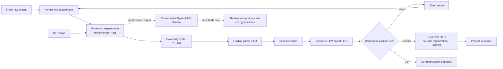

# HTST 우유 공정 시뮬레이터 모델 카드

## 1. 모델 식별 정보

| 항목 | 내용 |
|---|---|
| 모델명 | Continuous HTST Milk Process Research Simulator |
| 코드·기본 schema 버전 | `2.2.0` |
| 비바이오 통합 실행기 | `3.0.0` (`run_digital_twin.py`) |
| 기준 구현 | `model.py`, `process_components.py` |
| 실행·산출물 계약 | `run_scenarios.py`, `run_campaign.py`, `run_digital_twin.py`, `provenance.py` |
| 참조 계층 | `reference_pid.json`, `plc/`, `sensor_catalog.json`, `haccp_plan.json`, `maintenance_policy.json` |
| 불확실성 분석 | `uncertainty.py` |
| ML 계약 | `ml_contract.json`, `d3_rul_contract.json`, `ML_EXPERIMENTS.md`, `D3_RUL.md` |
| 유형 | 결정적으로 재현 가능한 동적 engineering surrogate |
| 기본 시간간격 / 실행시간 | 0.5 s / 900 s |
| simulator 시나리오 / ML canonical class | 21 / 20 |
| 시계열 필드 | 기본 202개 / campaign 209개, 모두 명시적 role 보유 |
| 작성 기준일 | 2026-07-27 |
| 공장·제품·규제 검증 | 미수행 |
| 바이오 모델 | 사용자 결정에 따라 명시적 제외 |

필수 상태 문구는 다음과 같다.

> Unvalidated engineering research surrogate. Not a regulatory, organism-specific, product-release, or plant-control tool.

v2.2는 문서화한 reduced-order simulator 계약에 필요한 열·수송·회송·CIP·FDV·고장·산출물 기능을 구현한다. v3는 공개자료 기반 P&ID, 교정, PLC shadow, HACCP 증거와 반복 정비/CIP lifecycle을 결합한다. 이 **소프트웨어 완결성**은 특정 공정의 물리적 정확성, 안전성 또는 현장 디지털 트윈 완성도를 뜻하지 않는다.

## 2. 의도한 목적과 금지 용도

### 의도한 목적

- HTST 열처리, 평균/fastest-flow 체류시간, 압력차, FDV, 회송, 후단 냉각과 CIP의 동적 상호작용 연구
- 정상·mode·단일/복합 고장 시나리오의 재현 가능한 회귀시험
- 생산→CIP→재기동의 versioned state carryover와 재기동 interface 연구
- 관측계측 기반 interlock와 숨은 plant truth의 구분
- volume/inventory/attribute/energy 잔차를 이용한 구현 감사
- domain-randomized synthetic 시계열과 누수 방지 ML 파이프라인 개발
- 중단 없는 단일 생산열화에서 scalar-fouling 건강도·right-censored RUL 연구
- 반복 생산/CIP와 교정·부분정비·overhaul·replacement가 있는 service-interval/RUL 연구
- P&ID–I/O–PLC cause/effect–교정–HACCP evidence의 기계판독 traceability 회귀시험
- 실제 데이터가 확보된 뒤 구조·파라미터 식별을 시작하기 위한 가설 모델

### 금지 용도

- 제품 출하, 폐기, 재처리, shelf-life 또는 소비 안전 결정
- 실제 PLC, SIS, FDV, pump, steam/cooling utility의 제어
- HACCP, 식품공전, FDA PMO 또는 다른 법규·인증 적합성 판정
- 병원체·CFU·D-value·증식·재오염·challenge-study와 기타 바이오 예측
- P&ID, FAT/SAT, 계측 교정, 추적자 RTD, 열분포 또는 challenge test 대체
- 합성데이터만으로 학습한 모델의 현장 배포
- `oracle`/`outcome` 필드를 온라인 ML 입력으로 사용

## 3. 근거와 식별 수준

공정 순서, 대표적인 HTST 시간·온도 범위, 재생식 열교환, holding tube, booster/압력차, FDV, balance tank, 냉각과 CIP의 구조적 근거는 [SOURCES.md](SOURCES.md)에 연결한다.

다음 값은 공개자료만으로 특정 공장에 식별할 수 없어 engineering assumption으로 남아 있다.

- 효과도, UA, holdup, 벽체 열용량과 동적 시정수
- 센서 잡음·지연·bias, PI gain과 PLC permissive 세부논리
- pump gain, 배관 압력손실, 누설·오염위험 관계
- FDV travel, 누설개도와 개도-유량 관계
- balance tank 용적·수위 제어·return delay·혼합정도
- fastest-flow 효율과 RTD 형상
- fouling 성장, 초기 soil, 세정 제거율, 배관 hold-up과 완료 threshold
- 제품 물성, utility 조건과 외란 분포

따라서 기본값은 공개 공정범위와 내부적으로 일관된 연구 기준점이지, 설계값·법정값·공장 추정값이 아니다.

## 4. 시스템 경계와 지배 관계



### 지배 plant

PI 제어와 routing 결과를 실제로 결정하는 plant는 효과도+1차 지연 reduced-order 모델이다. `preheat_temp_c`, `heater_out_temp_c`, holding parcel 온도, FDV routing과 post-FDV product temperature가 이 경로에서 계산된다.

### 보존형 shadow network

Regenerator, heater, cooler마다 별도 `DynamicHeatExchanger`가 양측 유체 bulk, 벽체, 유입 advection, UA/fouling 저항과 주위 열교환을 내부 sub-step으로 계산한다. 각 컴포넌트는 자신의 저장에너지 변화와 외부 에너지항 잔차를 닫는다.

`shadow_*` 출력은 지배 plant에 feedback되지 않는다. 따라서 shadow 수지 폐쇄는 코드의 보존형 컴포넌트 구현을 검증할 뿐, 실제 열교환기의 온도·효율·총 공정 에너지수지를 검증하지 않는다.

### 생산 회송과 CIP 경계

생산 회송액은 다음 step에 balance tank로 들어간다. CIP는 생산 탱크를 사용하지 않고 같은 thermal/transport 경로를 거친 뒤 `cip_recirculated_l` 경계로 전량 routing한다. 이 구분은 생산량과 CIP 순환량의 혼합 집계를 방지한다.

일반 `run_scenarios.py`의 각 scenario/run은 재현성과 기존 계약을 위해 새 상태로 독립 초기화된다. 연속 `production → CIP → restart`는 `run_campaign.py`/`HTSTSimulator.run_campaign()`으로 별도 실행한다. Campaign은 RNG, global clock, balance-tank moment와 pending return, 세 parcel FIFO, FDV 실제 위치, 지배 열상태, 세 shadow HX와 protein/mineral soil·line chemical 상태를 phase 사이에 인수하고, versioned JSON checkpoint로 중단·재개할 수 있다.

현재 transition policy `1.0.0`은 고정돼 있다. 물리 상태는 carry하고, 생산 balance tank는 CIP 유로에서 격리한 채 주위 열교환만 계속한다. CIP 진입은 FDV에 divert를 명령하되 실제 위치를 순간 이동시키지 않으며 phase 경계의 PI integral과 permissive 확인 메모리는 reset한다. CIP→재기동에서는 chemical/product interface 관측 proxy, 제품경계 parcel 조성과 제품온도 상한이 모두 threshold를 만족할 때까지 유체를 once-through transition drain으로 보내고 fresh product를 보충한다. 이는 구현 계약이며 실제 PLC transition sequence가 아니다.

## 5. 상태방정식과 안전 의미

### 수송과 열처리 진단

Holding, sensor-to-FDV line, post-FDV 구간은 각각 고정재고 parcel FIFO다. Partial slice는 온도, 입출구 시각, 평균 통과횟수, 위험·chemical 분율, 압력 적합성, 열처리 상태와 후단 고장 metadata를 보존한다.

```text
holding_volume = nominal_flow × nominal_holding_time
fastest_residence = mean_transport_residence × fastest_flow_efficiency
L_rel = (fastest_residence / t_ref) × 10^((T - T_ref) / z)
```

기본 fastest-flow 효율은 0.85다. 열 안전 진단은 `T >= diversion threshold`, `fastest residence >= minimum`, `L_rel >= 1`을 모두 요구한다. `L_rel`은 일반 상대지수이고 organism-specific lethality가 아니다. 지수는 유한 범위로 제한되며 제한 여부를 diagnostic으로 출력한다.

유량이 0인 동안 parcel inventory와 metadata는 정지하고 holding, sensor-to-FDV, post-FDV 온도만 정확한 지수완화식으로 주위온도에 접근한다. 실제 설비의 구간별 열손실 대신 단일 configurable 시정수를 사용한다.

### FDV

FDV 실제 위치는 `0..1` 연속값이다. 모델은 다음을 포함한다.

- sensor-to-valve line flush와 연속 안전 확인부피
- forward/divert 명령과 별도 회송 delay
- 선형 travel, step 내 위치 적분과 부분 forward volume
- 실제 위치 feedback, 허용오차와 mismatch 지속시간
- stuck-forward, slow travel, fail-divert와 leakage floor

위치에 비례한 routing은 연구용 축약이다. 실제 valve Cv, 압력의존 유량, seat geometry와 이중밸브 누설경로는 해석하지 않는다.

또한 permissive가 닫힌 즉시 유량이 이상적으로 0이 되는 모델이 아니다. 기본 유량·`dt`에서 booster failure와 F08은 FDV가 닫히는 동안 각각 `unsafe_forward_l=1.666667 L`의 부분 forward transient를 남겼고, F08의 `contamination_exposed_forward_l=1.666667 L`였다. 이 조건을 보편적 `unsafe_forward_l=0` fail-safe로 주장하지 않는다.

### 후단 regeneration/cooling

FDV를 통과한 forward parcel만 post-FDV FIFO에 들어간다. 해당 시각의 hot-side regeneration, cooling factor와 downstream fault metadata가 parcel에 고정되고, 기본 5초 재고 지연 뒤 제품 경계에 나타난다. 회송액은 이 후단 FIFO로 들어가지 않는다.

### Balance tank

`BalanceTank`는 완전혼합, 목표수위 make-up 모델이다. 부피뿐 아니라 temperature moment, pass count, risk·chemical·product volume을 수지화한다. Overflow, starvation과 최소재고 위반을 fail-fast로 처리한다. 이 상태는 생산 inlet과 회송 이력의 **지배 상태**다.

### Fouling과 CIP

생산 중 scalar fouling은 유량·온도·시나리오에 따라 성장하며 열효율과 압력손실에 영향을 준다. CIP 중에는 `CIPSoilModel`의 protein/mineral soil 잔량이 fouling 상태를 지배한다.

- Alkali는 protein soil, acid는 mineral soil을 제거한다.
- 제거율은 온도, 속도, 농도의 empirical 함수다.
- 배관 hold-up의 alkali/acid 잔류는 완전혼합 displacement로 감소한다.
- Conductivity와 pH는 잔류농도로부터 계산한 proxy다.
- `cip_cleaning_complete`는 total soil과 residual chemical 두 조건을 모두 만족해야 한다.

이는 surface coverage, deposit 층내 확산, 다상유동, biofilm, ATP/미생물 검사 또는 실제 rinse endpoint를 모델링하지 않는다.

Campaign에서는 생산 fouling과 soil 총량을 같은 surface state로 동기화한다. CIP 종료 soil이 내부 clean threshold를 넘으면 초과분에서 `surface_hygiene_risk_fraction`을 만들고 재기동 parcel에 전달한다. 저장된 1,020초 complete-CIP 예시는 CIP/재기동 종료 soil 241.315492/247.219819 g, 재기동 최대 전진 제품온도 4.699192°C, chemical·dilution·hygiene·통합 quality 부적합과 unsafe 전진량 모두 0 L였다. 동일 조건의 incomplete-CIP 예시는 soil 353.989771/359.829066 g, 최대온도 4.712984°C, chemical·dilution 부적합은 0 L지만 hygiene·통합 quality·unsafe 전진량이 각각 1,508.333333 L였다. 두 실행 모두 총 forward 1,524.444444 L, transition drain/addition 158.333333/161.111111 L다. 이 수치는 내부 soil-risk mapping의 결과일 뿐 미생물 위해량이나 실제 세정판정이 아니다.

### 압력·오염 proxy

Pasteurized-side 압력은 raw pressure, booster gain, 유량제곱 line loss와 fouling loss로 계산한다. 실제 누설이 있고 실제 압력차가 내부 요구값 미만일 때 contamination-risk proxy를 설정한다. 배관망, pump curve, plate 균열유동과 미생물 이동량은 범위 밖이다.

## 6. 관측, oracle과 결과 계약

`run_scenarios.py`는 기본 202개 필드를, campaign 실행기는 이 필드에 7개 phase context를 더한 209개 필드를 누락 없이 다음 role로 분류한다.

| role | 의미 | 기본 ML 처리 |
|---|---|---|
| `observable_signal` | 설치 가능한 계측 신호 | 설비 가용성 확인 후 후보 |
| `observable_alarm` | 관측 신호로 만든 PLC형 알람 | 알람 허용 실험에서만 후보 |
| `control` | 명령·actuator 상태 | 실험별 후보 |
| `context` | run, time, mode, seed, hash | 조인·분할·평가용 |
| `oracle` | 참상태, 주입 modifier, 내부 안전진단 | 입력 금지 |
| `outcome` | routing량, 안전/품질 결과 | label·평가 전용 |

관측 알람은 생산 mode의 저온, fastest 추정 체류시간 부족, 고유량, 저압력차와 mode 공통 온도센서 불일치, 누설검출, FDV mismatch, 고제품온도, sensor dropout이다. 생산 CCP 알람 네 종류는 CIP recipe에서 억제한다.

`alarm_count == observable_alarm_count`이며 관측 알람만 센다. `alarm_unsafe_forward`와 `alarm_high_fouling`은 각각 실제 parcel safety와 숨은 fouling truth를 사용하므로 별도 `diagnostic_alarm_count`와 `oracle_alarm_count`에만 포함한다. 관측 fouling alarm을 추가하려면 differential pressure/열효율 등 설치 계측으로 별도 추정기를 정의해야 한다. `total_alarm_count`는 분석 편의를 위한 합계지만 oracle role이므로 온라인 입력이 아니다.

상태 relay와 truth도 다음처럼 분리한다. `cip_conductivity_proxy_ms_cm`/`cip_ph_proxy`와 재기동용 `post_cip_*`, `restart_product_interface_signal_fraction`, `cip_release_permissive`는 설치 가능한 conductivity/pH/interface 계측과 PLC relay를 대신하는 합성 관측값이고 soil·잔류 chemical·surface-risk truth는 아니다. `power_good_signal`은 배포 시 관측 가능한 PLC power-status interface, `temperature_sensor_quality_ok`는 device/channel-status interface를 표현하지만, 현재 합성값은 각각 내부 `power_available`/`sensor_available`을 결정적으로 그대로 mirror한다. 따라서 독립 계측 검증이 아니며, F13/F15에 대한 결과는 status-aware direct detection으로 별도 표기하고 sensor-only ablation에서 두 relay를 제외해야 한다. truth 필드 자체는 ML 입력 금지 oracle이다. `plant_mode`는 조인·평가 context이지 기본 feature가 아니며 rule·EWMA·CUSUM baseline은 `cip_cycle_active`로 CIP 규칙을 gating한다.

## 7. 시나리오 카탈로그

Simulator는 아래 21개 이름을 허용한다. ML 계약은 호환 alias 하나를 통합해 20개 canonical class를 사용한다.

| simulator 이름 | canonical | 의미 |
|---|---|---|
| `normal` | `N00` | 정상 생산 |
| `start_stop` | `M01` | 정지·재기동 mode |
| `cip_cycle` | `M02` | 정상 CIP mode |
| `steam_loss` | `F01` | 가열능력 상실/저하 |
| `flow_surge` | `F02` | 실제 유량 급증 |
| `sensor_bias_high` | `F03` alias | control bias 호환 이름 |
| `control_sensor_bias_high` | `F03` | control 센서 step bias |
| `safety_sensor_bias_high` | `F04` | safety 센서 step bias |
| `dual_sensor_common_bias` | `F05` | 두 센서 공통 bias |
| `flowmeter_bias_low_with_surge` | `F06` | surge+표시유량 저편향 |
| `booster_pump_failure` | `F07` | booster 성능저하 |
| `regenerator_leak_pressure_inversion` | `F08` | 누설+압력역전 proxy |
| `progressive_fouling` | `F09` | fouling 가속 |
| `valve_stuck_forward_steam_loss` | `F10` | stuck-forward+저온 복합고장 |
| `cooling_utility_loss` | `F11` | 후단 냉각성능 저하 |
| `incomplete_cleaning` | `F12` | CIP 세정효율 저하 |
| `power_failure` | `F13` | 전원상실과 fail-divert |
| `sensor_drift` | `F14` | control 센서 ramp bias |
| `sensor_dropout` | `F15` | preheat/control/safety 온도센서 hold-last-value |
| `slow_valve` | `F16` | 느린 FDV 회송 |
| `valve_leakage` | `F17` | 회송명령 중 최소 forward 개도 |

`severity`는 `0..2`지만 고장마다 물리적 의미와 scale이 다르다. 동일 severity를 동일 고장크기나 발생확률로 비교하면 안 된다. 시나리오는 조건부 response 시험이며 실제 고장빈도를 나타내지 않는다.

## 8. 수치·보존·재현 보증

### 코드가 검사하는 불변식

- 모든 config와 출력 수치의 유한성
- `0.001 <= dt <= 1.0 s`, 최대 step 수와 queue size
- 마지막 partial step과 고장/CIP phase 경계의 정확한 분할
- holding, sensor-to-FDV, post-FDV 고정재고
- routed/forward/divert/CIP와 post-FDV 부피수지
- balance tank volume·temperature·pass·risk·chemical moment 및 외부 부피수지
- 각 DynamicHX shadow의 저장에너지 변화와 외부항 수지
- seed/config가 같은 반복 실행의 결정성
- timestep 변화에 따른 정상해 수렴 경향

### 자동시험 범주

```bash
python3 -m unittest discover -s tests -v
```

시험은 config, transport, valve, balance tank, CIP soil, shadow HX, 21개 시나리오, 알람/oracle 분리, CLI, provenance, 보고서, 불확실성 도구, campaign state/checkpoint/transition과 D1/D3 생성·split·audit·baseline 계약을 포함한다. 테스트 파일명이나 개수는 구현 확장에 따라 변하므로 현재 실행 결과를 기준으로 한다.

v3 시험은 기존 범주에 P&ID 연결·I/O, PLC cause/ST marker, 센서 replay·교정·불확실성, HACCP fail-closed/hash-chain, 반복 정비/CIP lifecycle과 통합 artifact 재현성을 추가한다. 시험 개수와 최종 결과는 위 회귀시험 명령의 현재 실행 결과를 따른다.

이 증거는 계산과 파일 계약이 코드 의도대로 동작함을 보인다. 실제 온도, 체류시간, 압력, 세정률 또는 고장 response와의 오차는 측정하지 않는다.

## 9. 산출물과 추적성

시나리오 실행은 staging에서 완료된 산출물만 결과 디렉터리에 publish한다.

- 시나리오 CSV와 observable event log
- config를 포함한 summary JSON
- 모든 필드의 type·role schema
- config hash, run ID, Python 버전, 선택 시나리오와 재현 명령
- `model.py`, `process_components.py`, 실행기와 provenance 코드의 SHA-256
- 생성 파일의 `checksums.sha256`

보고서 생성기는 checksum과 manifest/summary/config/run identity를 확인하고 CSV에서 KPI를 다시 계산한다. 불일치하면 결과를 신뢰하지 않고 실패한다. 이 provenance는 변조·혼합·재현 오류를 찾는 장치이며, 모델의 외부 타당성을 보증하지 않는다.

Campaign 실행기는 209-field CSV, canonical spec, event/transition log, phase checkpoint, 초기·최종 state, summary, schema, source manifest와 checksum을 staging에서 원자적으로 publish한다. 저장된 complete/incomplete 실행은 각각 3 phases, 2,040 rows, 1,020초이며 phase-boundary state hash로 인수관계를 고정한다.

v3 통합 실행기는 공정·센서·PLC·HACCP·lifecycle을 동일 config hash와 run ID 아래 결합하고 19개 artifact와 `checksums.sha256`을 원자적으로 publish한다. P&ID는 61 tag·23 line·26 I/O·6개 필수경로, PLC는 12 cause/effect, 센서 계층은 6개 합성 교정 레코드, HACCP은 5개 runtime gate, lifecycle은 4개 asset의 반복 service interval을 기록한다. 기본 실행과 전체 구조는 [README.md](README.md)를 따른다.

Monte Carlo는 같은 sample index의 config/noise를 시나리오 사이에 pair하고, 생산 시나리오는 `normal`, incomplete-cleaning은 `cip_cycle`과 mode-matched 차이를 계산한다. 현재 30-sample 실행은 주 시나리오 420회 + paired reference 60회 + OAT 770회, 총 **1,250 simulator runs**다. OAT는 common random numbers를 사용한다. 범위 endpoint, joint midpoint와 pairwise corner를 config validator로 사전 검사한다. 분포와 범위 역시 plant data에서 추정한 확률분포가 아니라 문서화된 실험 설계다.

## 10. ML 사용 조건

`ml_contract.json`은 `N00`, `M01`, `M02`, `F01`~`F17`을 정확히 한 번씩 포함하고 `sensor_bias_high`를 `F03` alias로만 처리한다. 생성 파이프라인은 plant profile을 episode보다 먼저 표본화하고 counterfactual group과 seed family를 같은 split에 둔다.

필수 조건은 다음과 같다.

- split은 row가 아니라 `plant_profile_id`/episode/counterfactual group 단위로 수행
- `scenario`, `fault_active`, truth, modifier, 결과 누적량과 미래정보는 feature에서 제거
- `signals.csv`와 `oracle_labels.csv`의 허용 조인키 외 컬럼 교집합 금지
- `physical_effect_time_s <= fault_effect_time_s`; 참 물리 효과가 관측 효과보다 늦은 episode는 감사 실패
- 미래 라벨은 `safety_event`, 제품경계 `unsafe_forward_event`, `diversion_event`, `cooling_excursion` 4종만 생성하고 episode 끝은 right-censor
- threshold, scaling, imputation과 feature selection은 train에서만 적합
- ID와 OOD profile/fault/combination/sensor test를 분리
- point 수가 아니라 profile·episode·event 단위 평가와 불확실성 보고
- Rule/EWMA/CUSUM baseline 성능을 현장 성능이나 안전증명으로 해석하지 않음

상세 과제, D1/D2 규모, 라벨, 누수감사와 평가 프로토콜은 [ML_EXPERIMENTS.md](ML_EXPERIMENTS.md)를 따른다.

2026-07-25에 재생성한 v2.2 D1 smoke는 4 profiles × 20 canonical class = 80 episodes, signal/label 각 19,200행이며 누수·계약 감사 **30/30 PASS**다. 이 수치는 파이프라인 smoke이지 정규 D1 성능 결과가 아니다.

별도 D3 파이프라인은 profile 단위 split, 실제 ID 범위와 겹치지 않는 OOD override, EOL persistence evidence, exact/censored RUL 분리와 train-only baseline fit을 강제한다. 저장된 v2.2 smoke는 6 profiles × 4 trajectories = 24 trajectories, OOD profile 1개, signal/label 각 990행, 관측 EOL 13건, right-censor 11건, 감사 **26/26 PASS**, baseline RUL landmark 175행이다. D3는 scalar fouling이 가속된 **중단 없는 단일 생산 run**만 다루며 campaign state나 반복 정비 후 수명회복을 RUL 근거로 사용하지 않는다. 이 smoke는 성능 benchmark가 아니다. 상세 계약과 재현 명령은 [D3_RUL.md](D3_RUL.md)에 있다.

v3 `lifecycle.py`는 D3와 분리된 반복 운전 계약이다. 가역 fouling, 비가역 damage, Kijima virtual age, complete/incomplete CIP, scheduled action, competing failure와 마지막 interval right censor를 계산한다. 이 계수는 현장 정비이력에 적합하지 않았으며, v3 산출물을 D3 학습 라벨 또는 실제 정비주기로 자동 전환하지 않는다.

## 11. 알려진 한계와 실패 가능성

- 완전혼합 tank, plug-flow parcel과 고정 fastest-flow 계수는 실제 RTD·dead zone·축방향 분산을 재현하지 않는다.
- 생산 return은 one-step stream이며 별도 배관 FIFO, 수위제어 valve와 overflow routing이 없다.
- 지배 열모델은 구간별 PHE 형상·분포정수 모델이 아니고, 보존형 HX는 shadow뿐이다.
- 정지 열이력은 모든 parcel에 같은 단일 시정수를 사용한다.
- 압력은 algebraic proxy라 pump curve, cavitation, water hammer와 망 상호작용이 없다.
- FDV는 선형 travel과 개도비례 유량을 사용한다.
- Fouling/CIP kinetics, pH와 conductivity는 empirical proxy이고 표면·미생물 검증이 없다.
- 공개 참조 CIP 회로 topology는 구현됐지만 as-built 배관, 배관별 잔류물·표면 분포와 다층 deposit은 해석하지 않는다. 바이오 계층은 범위에서 제외했다.
- D3 health/RUL은 독립적인 uninterrupted-production scalar-fouling 궤적이다. v3 lifecycle은 multi-maintenance campaign을 구현하지만 합성 계수이므로 부품 고장수명 또는 실제 정비기준이 아니다.
- 센서 lag·gain·offset·drift·hysteresis·noise·quantization·dropout과 교정주기는 구현됐지만 합성값이며, 실제 colored noise·network loss·교정성적서를 재현하지 않는다.
- prescribed fault catalogue 밖의 복합고장, 작업자 조작, 원료 lot 변동과 utility disturbance는 포괄하지 않는다.
- 코어의 상대 열처리 지수와 contamination flag는 organism-specific risk가 아니며 v3의 바이오 증거로 사용하지 않는다.
- 에너지 KPI는 지배 reduced-order plant의 비교용 값이며 shadow network와 하나의 검증된 총열수지로 결합되지 않는다.

가장 중요한 잔여 불확실성은 코드 누락보다 **plant-specific parameter identifiability**다. 참조 P&ID·PLC·교정·HACCP·lifecycle 소프트웨어는 구현됐지만, 정확한 as-built P&ID, historian, tracer RTD, 실제 센서 교정, utility/energy, valve response, CIP endpoint와 정비 event 데이터 없이는 특정 공장과의 오차를 추정할 수 없다.

## 12. 변경 관리

모델 변경 시 다음을 함께 갱신한다.

1. `MODEL_VERSION`과 필요한 schema/contract version
2. 신규 상태·필드의 명시적 role
3. 보존·결정성·경계·회귀 자동시험
4. [SOURCES.md](SOURCES.md)의 근거와 engineering assumption 구분
5. 본 모델 카드, [README.md](README.md), [ML_EXPERIMENTS.md](ML_EXPERIMENTS.md), [SOURCES.md](SOURCES.md)
6. 시나리오·불확실성·ML 산출물과 checksum

Plant data로 보정하더라도 calibration과 독립 validation을 분리하고, 데이터 범위 밖 extrapolation을 명시해야 한다. 외부 검증이 완료되기 전에는 이 카드의 `미검증 engineering research surrogate` 상태를 유지한다.
