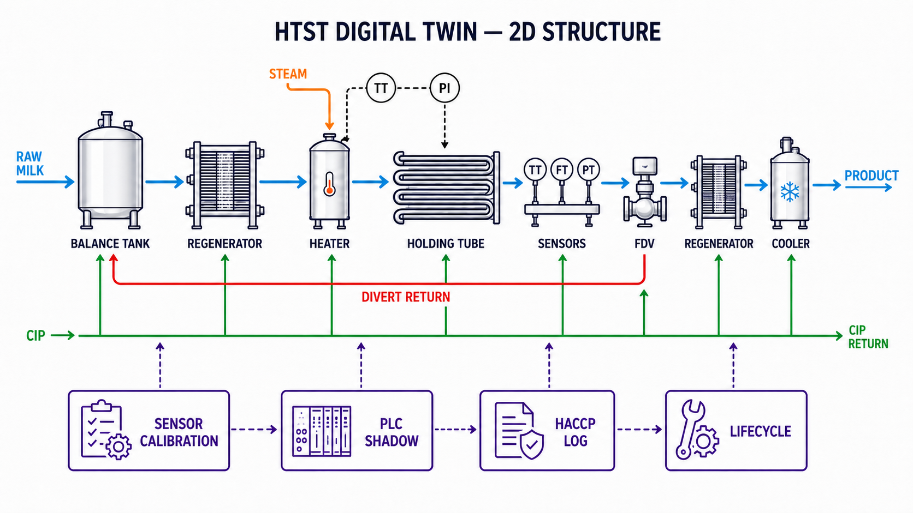
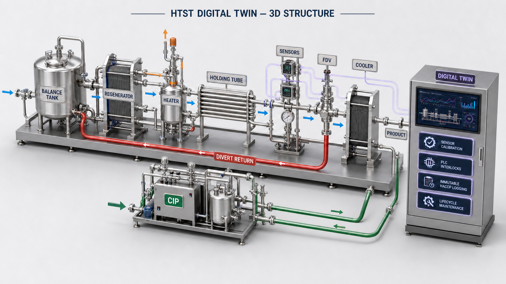
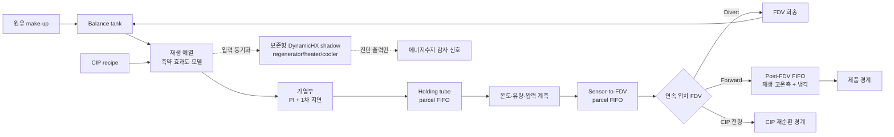

# 연속식 우유 HTST 공정 시뮬레이터 v2.2 + 통합계층 v3

> 상태: 재현 가능한 동적 **연구용 surrogate**
> 공정 코어·기본 schema 버전: `2.2.0`
> 비바이오 통합 실행기 버전: `3.0.0`
> FlowTwin-Guard benchmark protocol: `0.2.0` · runner: `0.3.0`
> 시뮬레이터 런타임 의존성: Python 표준 라이브러리 · FlowTwin-Guard 선택 의존성: `requirements-ml.txt`
> 물리·공장·규제 검증: **미수행** · 바이오 모델: **명시적 제외**

이 디렉터리는 연속식 우유 HTST 공정의 기동, 생산, 회송, CIP, 센서, PI 제어, 압력차, FDV(flow-diversion valve), 오염·세정과 고장 주입을 합성 시계열로 재현한다. v3 실행기는 여기에 기계판독 P&ID, 센서 교정·불확실성, PLC shadow, HACCP 증거원장과 반복 정비/CIP 수명모델을 결합한다. 문서화한 surrogate 계약의 소프트웨어 구현은 완료돼 있지만, 특정 공장의 디지털 트윈은 아니다.

`safe`, `unsafe`, 상대 열처리 지수, 오염 위험, 세정 완료와 모든 알람은 코드 안의 가정에 따른 **시뮬레이션 진단값**이다. 실제 제품 출하, CCP 설정, 설비 제어, HACCP 또는 법규 적합성 판정에 사용하면 안 된다.

전체 구조, 외부자료-코드 추적, GitHub Mermaid 도면, 실행법과 ML 실험 구성은 이 README와 [SOURCES.md](SOURCES.md), [ML_EXPERIMENTS.md](ML_EXPERIMENTS.md)에 정리돼 있다. 새 공정전용 진단모델의 구조·loss·실행·ablation은 [FLOWTWIN_GUARD.md](FLOWTWIN_GUARD.md), 선행연구 대비 주장 경계·H1–H5·출판 게이트는 [NOVELTY_EVALUATION.md](NOVELTY_EVALUATION.md)를 따른다. Benchmark protocol `0.2.0`은 FlowTwin-Guard 1개, neural baseline 6개, ablation 9개의 **16개 variant**를 등록하며, 가장 가까운 선행연구인 DSPR을 `dspr_diagnostic_adaptation`으로 포함한다. 이 baseline은 저자 코드의 exact reproduction이 아니라 논문 식을 인과적 HTST 진단 계약에 맞춘 독립 adaptation이다. 병원체·CFU·D-value·증식·challenge-study 모델은 사용자 결정에 따라 v3 범위에서 제외했다. 코어의 과거 무차원 상대 열처리 진단값을 생물학적 결과로 해석해서는 안 된다.

## 구조 이미지

### 2D 공정·제어 구조



파란색은 제품 흐름, 주황색은 열원, 빨간색은 FDV 회송, 초록색은 CIP, 보라색 점선은 센서·PLC·HACCP·수명계층의 데이터 흐름이다.

### 3D 설비 배치 개념도



두 이미지는 코드의 참조 위상을 설명하기 위한 개념도이며 실제 공장의 배관 치수, 설치 위치 또는 as-built P&ID를 나타내지 않는다. 기계판독 가능한 상세 연결은 [reference_pid.json](reference_pid.json), 실행 시 생성되는 전체 Mermaid P&ID는 `digital_twin_results/reference_plant.md`를 따른다.

## 빠른 시작

저장소 루트에서 전체 자동시험을 실행한다.

```bash
python3 -m unittest discover -s tests -v
```

통합 비바이오 실행을 먼저 재현하려면 다음 명령을 사용한다.

```bash
python3 run_digital_twin.py
```

이 실행은 기본적으로 `digital_twin_results/`에 공정·센서·PLC·HACCP·lifecycle trace, P&ID Mermaid, schema, manifest와 checksum을 원자적으로 생성한다. 시험 개수는 구현 확장에 따라 바뀌므로 위 `unittest discover` 명령의 현재 결과를 기준으로 한다.

공정전용 FlowTwin-Guard ML 환경을 만든다. 공정 simulator의 표준 라이브러리 계약은 그대로 유지되고 이 환경은 ML 실행에만 필요하다.

```bash
python3.12 -m venv .venv
.venv/bin/pip install -r requirements-ml.txt

.venv/bin/python build_flowtwin_cache.py \
  --dataset ml_datasets/D1-pilot \
  --splits ml_datasets/D1-pilot-splits \
  --output ml_datasets/D1-pilot-cache-v0.3 \
  --feature-set S3-context
```

`D1-pilot-cache-v0.3` manifest는 dataset/split manifest와 checksum, 1,200개 episode materialization, train-only scaler, 그리고 `ml_pipeline_common.py`를 포함해 cache를 만든 전체 소스 파일의 SHA-256을 같이 묶는다. 소스가 바뀌었는데 예전 cache를 재사용하면 loader가 실행을 거부한다.

등록된 16개 variant×3 seeds의 D1 ID-only full pilot은 다음과 같이 실행한다. D1에는 검증된 `test_ood_profile`이 없으므로 이 명령을 exact budget으로 끝내도 tier는 `pilot`이지 `protocol_complete_synthetic`이 아니다.

```bash
.venv/bin/python run_flowtwin_benchmark.py \
  --dataset ml_datasets/D1-pilot \
  --splits ml_datasets/D1-pilot-splits \
  --cache ml_datasets/D1-pilot-cache-v0.3 \
  --contract flowtwin_benchmark_contract.json \
  --output ml_results/FlowTwin-Benchmark-D1-v0.2-full \
  --variants all \
  --seeds 20260727 20260728 20260729 \
  --window-size 64 \
  --stride 32 \
  --train-windows-per-episode 12 \
  --batch-size 32 \
  --observer-epochs 3 \
  --epochs 10 \
  --hidden-dim 32 \
  --observer-hidden-dim 48 \
  --layers 2 \
  --attention-heads 4 \
  --dropout 0.1 \
  --learning-rate 0.001 \
  --weight-decay 0.0001 \
  --alpha 0.1 \
  --ood-alpha 0.01 \
  --device cpu \
  --save-predictions
```

먼저 코어 비교 경로만 빠르게 검사하는 reduced development run은 다음과 같다. 이 결과는 budget·variant·seed를 축소했으므로 논문 성능표에 쓸 수 없다.

```bash
.venv/bin/python run_flowtwin_benchmark.py \
  --dataset ml_datasets/D1-pilot \
  --splits ml_datasets/D1-pilot-splits \
  --cache ml_datasets/D1-pilot-cache-v0.3 \
  --contract flowtwin_benchmark_contract.json \
  --output ml_results/FlowTwin-Benchmark-D1-core-dev-v0.3 \
  --variants flowtwin_guard tcn dspr_diagnostic_adaptation \
  --seeds 20260727 \
  --window-size 32 \
  --stride 32 \
  --train-windows-per-episode 4 \
  --batch-size 64 \
  --observer-epochs 1 \
  --epochs 1 \
  --hidden-dim 16 \
  --observer-hidden-dim 24 \
  --layers 1 \
  --attention-heads 4 \
  --dropout 0.1 \
  --learning-rate 0.001 \
  --weight-decay 0.0001 \
  --alpha 0.1 \
  --ood-alpha 0.01 \
  --device cpu
```

기존 `ml_results/FlowTwin-Benchmark-D1-core-dev-v0.2/`는 같은 3-variant×1-seed 경로를 완주했지만, `ml_pipeline_common.py` materialization source provenance를 누락한 구 cache v0.2를 사용했다. 따라서 역사적 development/pipeline 기록으로만 남기고 현재 성능 근거에서 제외한다.

OOD 실행용 `ml_datasets/D2-ood-dev` 데이터는 생성·split·감사와 `D2-ood-dev-cache-v0.3` materialization까지 완료됐다. ID 12 + OOD 4 = 16 profiles, 48 counterfactual groups, 960 episodes, signal/label 각 1,728,000 rows이며, split은 train 7/420, validation 2/120, test-ID 3/180, test-OOD 4/240 profiles/episodes이다. OOD 4 profiles는 `OOD_LOW_FLOW` 2개와 `OOD_HIGH_FLOW_WARM_FEED` 2개이고 감사 30/30을 통과했다. Domain verifier는 profile config hash, 실제 33개 physical parameter, 계약 range 일치와 domain 사이 strict support gap을 확인한다.

`ml_results/FlowTwin-Benchmark-D2-core-budget-v0.2/`에는 frozen 비시드 budget을 적용한 FlowTwin/TCN/DSPR 3-model×1-seed 실행이 checksum과 함께 저장돼 있다. 전체 macro-F1은 각각 `0.44545/0.56266/0.58609`, OOD AUROC는 `0.81138/0.41887/0.58005`, event-F1은 `0.01872/0.03626/0.25665`, false-alarm onset은 `347.85/169.85/3.09 h⁻¹`였다. FlowTwin은 OOD 순위와 탐지 전 unsafe volume에서 가능성을 보였지만 class/event 성능은 strongest baseline보다 낮고 오경보가 가장 많았다. 세 모델 모두 conformal 평균 set이 10.34–12.60 classes이고 singleton `DIAGNOSE=0`이었다. 선택 variant·단일 seed 실행이라 tier는 `development`이며, 아직 D2 16-variant×3-seed full matrix를 실행하지 않았으므로 이를 우월성 또는 `protocol_complete_synthetic` 성능 완료로 표현하지 않는다.

### FlowTwin v0.3 opened-D2 post-hoc 개발 결과

v0.3은 D2 test를 이미 열어 본 뒤 선택한 W96·seed `20260727` 후보이므로 전부 `development_only`다. 원 산출물은 `ml_results/FlowTwin-v03-D2-candidate-matched-dev`, `FlowTwin-v03-D2-flowtwin-operational-dev`, `FlowTwin-v03-D2-tcn-raw-diagnostic-dev`, `FlowTwin-v03-D2-dspr-operational-dev`, `FlowTwin-v03-D2-tcn-alarm-feasibility-dev`에 나뉘어 있다. 단일 4-model atomic run은 TCN의 validation operational gate `0/75`로 fail-closed됐으며, TCN test operational 수치는 없다.

아래 `전체` macro-F1은 ID/OOD row를 합친 descriptive pooled 값이며 profile-level 추론 결과가 아니다.

| 모델 | parameter | 전체 / ID / OOD macro-F1 | validation-fitted row event-F1 | row-threshold FA h⁻¹ | row-threshold unsafe L | OOD AUROC / FPR95 |
|---|---:|---:|---:|---:|---:|---:|
| FlowTwin-Hybrid v0.3 | 58,315 | 0.56218 / **0.68129** / 0.53188 | 0.03452 | 186.51 | 414.37 | 0.55268 / 0.91749 |
| FlowTwin-Guard | 42,508 | 0.42491 / 0.55566 / 0.37698 | 0.02686 | 245.83 | 0.00 | **0.76773** / 0.93618 |
| TCN | 15,379 | 0.58313 / 0.64073 / 0.54890 | 0.02222 | 285.31 | 56.31 | 0.45451 / 0.98143 |
| DSPR adaptation | 54,166 | **0.59399** / 0.61125 / **0.58642** | **0.31215** | **5.24** | 4,081.49 | 0.57475 / 0.93870 |

Validation gate를 통과한 Hybrid/FlowTwin/DSPR의 combined-test operational event-F1은 `0.87690/0.90040/0.88438`, FA는 `5.744/7.770/3.276 h⁻¹`, unsafe volume은 `436.18/10.51/3,674.27 L`였다. Hybrid은 ID macro-F1만 1위이고 전체·OOD·operational 전반의 우월성은 없다. Hybrid/FlowTwin의 validation 최대 profile FA `3.40/4.29 h⁻¹`는 test profile에서 `9.42/9.09 h⁻¹`로 상승해 일반화에 실패했다. DSPR은 FA를 낮췄지만 recall `0.81322`와 unsafe `3,674.27 L`의 trade-off가 크다. `F05` recall은 전 모델 `0`, Hybrid `F09` recall도 `0`이고, conformal `DIAGNOSE`는 네 모델 모두 `0`이다. 병렬 CPU 경합을 포함한 timing은 비교하지 않고 parameter count만 보고한다.

산출물·재현 명령·validation feasibility·조건부 3-model operational 표는 [FLOWTWIN_GUARD.md](FLOWTWIN_GUARD.md)에, 실험 해석은 [ML_EXPERIMENTS.md](ML_EXPERIMENTS.md)에 고정했다. GitHub에서 바로 확인할 수 있는 소형 결과표는 [docs/results/flowtwin-v03](docs/results/flowtwin-v03/README.md)에 공개하며, 표준 합성 보고서의 로컬 출력 경로는 `ml_results/FlowTwin-v03-D2-development-report`다. 이 결과는 novelty, external-OOD, 현장 정확도, 살균 유효성, HACCP 적합성 또는 제품 안전을 입증하지 않는다.

정규 D1 생성·감사 명령, 동적 graph 도식, 산출물 계약과 정확한 평가 경계는 [FLOWTWIN_GUARD.md](FLOWTWIN_GUARD.md)에 있다. `protocol_complete_synthetic`은 등록 16개 variant·3 seeds·exact CPU budget과 검증된 ID/OOD partition을 모두 충족한 합성 실험 label일 뿐이며, runner는 절대 `external_confirmatory` 또는 현장 검증 label을 부여하지 않는다.

21개 simulator 시나리오를 기본 설정으로 실행한다.

```bash
python3 run_scenarios.py
```

생산→CIP→재기동 상태 연속 campaign을 실행한다. 일반 시나리오 실행은 독립 초기화를 유지하고, campaign 전용 CLI만 phase 사이 상태를 인수한다.

```bash
python3 run_campaign.py \
  --spec campaign_specs/complete_cip.json \
  --output /tmp/htst-complete-cip-campaign

python3 run_campaign.py \
  --spec campaign_specs/incomplete_cip.json \
  --output /tmp/htst-incomplete-cip-campaign
```

선택한 시나리오만 별도 디렉터리에 실행한다.

```bash
python3 run_scenarios.py \
  --scenarios normal steam_loss start_stop sensor_dropout valve_leakage \
  --duration 900 \
  --dt 0.5 \
  --seed 20260724 \
  --fault-start 300 \
  --fault-duration 120 \
  --severity 1.0 \
  --output results_v2
```

생성 결과의 manifest와 checksum을 검증하고 보고서를 만든다.

```bash
python3 generate_report.py \
  --results-dir results_v2
```

Monte Carlo와 OAT(one-at-a-time) 민감도 분석을 실행한다.

```bash
python3 uncertainty.py \
  --runs 100 \
  --output uncertainty_results_v2
```

## 공정 경계와 위상



핵심 위상은 `holding → 계측 위치 → sensor-to-FDV line → FDV → forward 전용 post-FDV regeneration/cooling FIFO → 제품 경계`다. FDV에서 회송된 유체는 온도, 평균 통과횟수, 위험분율과 화학분율을 보존한 채 다음 step에 balance tank로 돌아간다. CIP는 생산 balance tank와 분리된 재순환 경계로 보낸다.

## 구현된 동역학

### Balance tank와 회송

`BalanceTank`는 완전혼합 탱크로 구현한다. 원유 make-up, 직전 step 회송액, 공정 공급량을 함께 수지화하고 목표 초기수위를 유지한다. 다음 상태를 부피가중 moment로 운반한다.

- 온도와 주위 열교환
- 평균 공정 통과횟수
- 회송 오염위험 분율
- 잔류 화학물질 분율
- 제품/세정 interface 분율

탱크 overflow, 공급부족, 최소 운전재고 위반은 즉시 오류로 중단한다. timestep별 부피·온도 moment·통과횟수·위험·화학물질 수지와 실행 전체 외부 부피수지를 출력한다.

### 지배 열모델과 보존형 shadow 열교환기

제어 plant를 실제로 움직이는 지배 모델은 재생 효과도, 가열부 PI 제어, 가열·냉각 효과도와 1차 지연으로 구성된 reduced-order 모델이다. Fouling은 재생효과, 가열능력과 압력손실을 변화시킨다.

이와 별도로 `DynamicHeatExchanger` 세 개가 regenerator, heater, cooler의 양측 유체 holdup과 벽체 열용량을 푼다. 내부 sub-step, UA, fouling 저항과 주위 열교환을 포함하며 각 step의 에너지 잔차를 출력한다. 이 네트워크는 **shadow 진단 모델**이다. `shadow_*` 온도나 UA가 PI 제어 또는 제품온도를 지배하지 않으므로, shadow 수지 폐쇄를 실제 설비 열수지 검증으로 해석하면 안 된다.

### Holding tube, fastest-flow proxy와 정지 유체

Holding tube는 고정 용적의 parcel FIFO다. 각 parcel의 유입 구간을 보존하고 부분 배출 시 입·출구 중간시각을 보간하므로, 명목 평균 수송 체류시간에 timestep 크기만큼의 체계적 편향을 넣지 않는다.

```text
holding_volume = nominal_flow × nominal_holding_time
fastest_residence = mean_transport_residence × fastest_flow_efficiency
L_rel = (fastest_residence / t_ref) × 10^((T - T_ref) / z)
```

기본 `fastest_flow_efficiency=0.85`는 실제 RTD를 대신하는 보수적 proxy다. 열 안전 진단과 최대 안전유량은 평균 체류시간이 아니라 이 fastest-flow 체류시간을 사용한다. `L_rel`은 일반적인 무차원 상대 열처리 지수이며 특정 미생물의 D/z값이나 사멸률이 아니다. 지수 계산은 유한 범위로 제한하고 제한 발생횟수를 diagnostic으로 남긴다.

유량이 0이면 holding, sensor-to-FDV line, post-FDV inventory의 parcel을 이동시키지 않는다. 온도는 `exp(-dt/tau)`로 주위온도에 완화되므로 정전·정지 중 열이력이 보존된다.

### FDV와 후단 FIFO

FDV는 이진 스위치가 아니라 `0..1`의 실제 위치를 갖는다. 전진 전 line flush와 확인부피, 회송 actuation delay, 양방향 travel time, 위치 feedback, mismatch, stuck-forward, 느린 이동과 최소 누설개도를 모델링한다. 한 step 안에서 이동한 위치 적분으로 forward/divert 부피를 나눈다.

전진한 parcel만 고정 `post_fdv_inventory_l` FIFO에 들어간다. 재생 고온측과 냉각 조건, 후단 고장 여부, chemical/product/hygiene fraction을 parcel metadata로 붙여 실제 제품 경계에는 설정한 후단 체류시간 뒤 도달시킨다. 따라서 냉각 고장의 품질 영향과 복구가 고장 주입시각에 즉시 나타나지 않는다.

안전 permissive가 닫혀도 연속 FDV가 이동하는 step 안에서는 일부 유량이 전진 분기로 갈 수 있다. 기본 유량·`dt` 조건에서 booster failure와 F08은 밸브 폐쇄 transient로 각각 `unsafe_forward_l=1.666667 L`를 남겼고, F08의 `contamination_exposed_forward_l=1.666667 L`였다. 따라서 압력 interlock를 조건 없는 `0 L` fail-safe로 해석하지 않는다. `unsafe_forward_event`는 명령·밸브 위치가 아니라 post-FDV FIFO를 거쳐 제품 경계에 도달한 `unsafe_forward_l > 0`으로 정의한다.

### 계측, interlock와 압력 proxy

Plant truth, 관측 계측, 제어 상태, oracle/outcome을 분리한다. 전진 permissive는 다음 관측가능 조건으로만 결정한다.

- 생산모드이며 유량과 전원이 가용할 것
- 안전온도가 기준과 전진 margin 이상일 것
- 측정유량으로 계산한 fastest-flow 추정 체류시간이 최소값 이상일 것
- 측정유량이 계산된 최대 안전유량 이하일 것
- 측정 pasteurized-to-raw 압력차가 요구값 이상일 것
- 독립 온도센서 disagreement와 누설검출 알람이 없을 것
- 센서 dropout이 없을 것

압력은 booster gain, 유량 제곱 압력손실과 fouling 손실을 합친 hydraulic proxy다. 누설과 실제 압력차 부족이 동시에 존재할 때 `contamination_risk`를 설정하지만, 유체망·plate 파손·미생물 이동을 해석하지는 않는다.

### Fouling과 상세 CIP soil

생산 중에는 scalar `fouling_index`가 유량·온도·시나리오 가속계수에 따라 증가한다. CIP에서는 이 값을 별도 `CIPSoilModel`의 잔존 soil 총량에 연결한다.

| 시간 | phase | 설정 proxy |
|---:|---|---|
| 0–60 s | `CIP_PRE_RINSE` | 예비 수세 |
| 60–240 s | `CIP_CAUSTIC` | 2% alkali proxy |
| 240–300 s | `CIP_INTERMEDIATE_RINSE` | 중간 수세 |
| 300–420 s | `CIP_ACID` | 1% acid proxy |
| 420–540 s | `CIP_FINAL_RINSE` | 최종 수세 |
| 540 s 이후 | `CIP_COMPLETE` | 유량 정지 |

가성 단계는 protein soil, 산 단계는 mineral soil을 각각 온도·속도·농도 의존 지수식으로 제거한다. 완전혼합 displacement 식으로 배관 hold-up의 alkali/acid 잔류량을 추적하고 conductivity·pH proxy를 계산한다. `cip_cleaning_complete`는 잔존 soil과 잔류 화학물질이 모두 내부 threshold 아래일 때만 1이다. 이 kinetics와 threshold는 식별되지 않은 연구 가정이다.

`run_scenarios.py`의 각 scenario/run은 이전 버전과 같이 새 simulator로 독립 초기화한다. 연속 운전을 연구할 때는 `run_campaign.py` 또는 `HTSTSimulator.run_campaign()`을 사용한다. 이 경로는 RNG, 전역 campaign clock, balance tank moment, 회송 stream, holding/sensor-to-FDV/post-FDV FIFO, FDV 실제 위치, 지배 plant, 세 shadow HX와 protein/mineral soil·line chemical 상태를 phase 경계에서 인수한다. Versioned JSON checkpoint를 export/import할 수 있고 phase 경계에서 중단 후 재개한 결과가 무중단 실행과 같도록 시험한다.

Transition policy `1.0.0`은 임의 선택지가 아니라 현재 구현에 고정돼 있다.

- 물리 상태와 RNG는 carry한다.
- 생산 balance tank는 CIP 유로와 격리하되 CIP 동안 주위 열교환은 계속 계산한다.
- CIP 진입 시 FDV는 divert를 명령하지만 실제 위치를 순간이동시키지 않는다.
- phase 경계에서 PI 적분기와 permissive 확인 메모리를 reset한다.
- CIP→생산 재기동은 holding의 chemical/product interface proxy, 제품경계 parcel 조성과 제품온도 상한을 함께 검사한다. 적합해질 때까지 회송·제품경계 유체를 once-through transition drain으로 보내고 fresh product를 보충한다.

저장된 두 1,020초 campaign은 동일한 120초 생산→600초 CIP→300초 재기동 조건이다.

| 저장 결과 | CIP / 재기동 종료 soil | 재기동 최대 전진 제품온도 | chemical / dilution OOS | hygiene / 통합 quality OOS / unsafe |
|---|---:|---:|---:|---:|
| complete CIP | 241.315492 / 247.219819 g | 4.699192°C | 0 / 0 L | 0 / 0 / 0 L |
| incomplete CIP | 353.989771 / 359.829066 g | 4.712984°C | 0 / 0 L | 1,508.333333 / 1,508.333333 / 1,508.333333 L |

두 실행 모두 총 제품경계 전진량은 1,524.444444 L, `transition_drained_l`은 158.333333 L, `transition_added_l`은 161.111111 L다. `quality_out_of_spec_l`은 온도뿐 아니라 chemical·dilution·hygiene 조건을 합친 통합량이다. 위 차이는 코드가 잔류 surface-soil proxy를 재기동 parcel의 hygiene-risk로 전달한다는 결정적 예시이지, 실제 세정완료·미생물 위해 또는 출하 적합성 증거가 아니다.

## 알람과 ML 누수 방지

기본 `run_scenarios.py`의 `schema.json`은 202개 출력 필드를, campaign `schema.json`은 기본 필드와 7개 phase context를 합친 209개 필드를 다음 역할 중 하나로 명시한다.

| 역할 | 용도 |
|---|---|
| `observable_signal` | 목표 공장에 실제 설치돼 있을 때만 ML 입력 후보 |
| `observable_alarm` | PLC 유래 알람; 알람 허용 실험에서만 입력 |
| `control` | 명령 또는 actuator 상태 |
| `context` | 시간, mode, episode와 재현 메타데이터 |
| `oracle` | 참상태·주입 고장·modifier·안전진단; ML 입력 금지 |
| `outcome` | 누적·routing 결과; label/평가 전용 |

`alarm_count`와 `observable_alarm_count`에는 관측 알람만 포함한다. 생산 온도·체류시간·유량·압력차 CCP 알람은 CIP mode에서 억제한다. `alarm_unsafe_forward`와 `alarm_high_fouling`은 각각 참 parcel 안전상태와 숨은 fouling truth를 직접 사용하므로 `diagnostic_alarm_count`/`oracle_alarm_count`에만 들어가며 관측 알람 사건 수와 섞지 않는다.

ML 계약에서 `cip_conductivity_proxy_ms_cm`과 `cip_ph_proxy`, 재기동용 `post_cip_*`와 `restart_product_interface_signal_fraction`, `cip_release_permissive`는 설치 가능한 계측·PLC interface를 표현한 관측 proxy이고, soil·잔류 chemical oracle은 아니다. `power_good_signal`은 배포 시 관측 가능한 PLC power-status interface, `temperature_sensor_quality_ok`는 device/channel-status interface를 표현한다. 현재 합성구현에서는 각각 내부 truth `power_available`, `sensor_available`을 **결정적으로 그대로 mirror**하므로 독립 계측이 아니다. 두 relay를 쓰면 F13/F15 direct-status 탐지가 쉬워지므로 status-aware 결과로 별도 보고하고 sensor-only ablation에서는 제외한다. oracle 필드 자체는 기본 ML 입력에서 금지한다. `plant_mode`는 조인·mode별 평가 context일 뿐 기본 feature가 아니며, 기준선은 관측/제어 relay `cip_cycle_active`로 생산·CIP 규칙을 gating한다.

## 21개 simulator 시나리오와 20개 ML class

| simulator 이름 | ML class | 주입 또는 mode |
|---|---|---|
| `normal` | `N00` | 정상 생산 기준선 |
| `start_stop` | `M01` | 유량·가열·booster 정지와 재기동 |
| `cip_cycle` | `M02` | 정상 6단계 CIP |
| `steam_loss` | `F01` | 가열능력 감소 |
| `flow_surge` | `F02` | 실제 유량 증가 |
| `sensor_bias_high` | `F03` alias | 아래 control bias의 호환 이름 |
| `control_sensor_bias_high` | `F03` | control 온도센서 양의 step bias |
| `safety_sensor_bias_high` | `F04` | safety 온도센서 양의 step bias |
| `dual_sensor_common_bias` | `F05` | 두 온도센서 공통 bias |
| `flowmeter_bias_low_with_surge` | `F06` | 실제 surge와 표시유량 음의 bias |
| `booster_pump_failure` | `F07` | booster 성능 저하 |
| `regenerator_leak_pressure_inversion` | `F08` | booster 저하, 누설과 압력역전 proxy |
| `progressive_fouling` | `F09` | fouling 증가율 가속 |
| `valve_stuck_forward_steam_loss` | `F10` | 저온과 stuck-forward 복합고장 |
| `cooling_utility_loss` | `F11` | 후단 냉각능력 감소 |
| `incomplete_cleaning` | `F12` | CIP 세정효율 저하 |
| `power_failure` | `F13` | 유량·가열·booster 정지, fail-divert |
| `sensor_drift` | `F14` | control 온도센서 ramp bias |
| `sensor_dropout` | `F15` | preheat/control/safety 온도계측 hold-last-value와 dropout 알람 |
| `slow_valve` | `F16` | 저온 회송 요구와 FDV 이동시간 증가 |
| `valve_leakage` | `F17` | 저온 회송 요구와 최소 forward 개도 |

Simulator 이름은 21개지만 `sensor_bias_high`가 `control_sensor_bias_high`의 동작 호환 alias이므로 ML taxonomy는 `N00`, `M01`, `M02`, `F01`~`F17`의 20개 canonical class다. 자세한 데이터 계약과 실험 설계는 [ML_EXPERIMENTS.md](ML_EXPERIMENTS.md)를 따른다.

## 주요 기본값

| 항목 | 기본값 |
|---|---:|
| 실행시간 / `dt` | 900 s / 0.5 s |
| 정격유량 | 20,000 L/h |
| 원유 / 살균 setpoint | 4°C / 74°C |
| diversion 기준 / 전진 margin | 72°C / 0.30°C |
| 평균 명목 / fastest 명목 / 최소 체류 | 18 / 15.3 / 15 s |
| holding / FDV line / post-FDV 재고 | 100 / 8.33 / 27.78 L |
| 계산 최대 안전유량 | 20,400 L/h |
| post-FDV 체류시간 | 5 s |
| 제품 목표 / 내부 상한 | 4°C / 6°C |
| 재생 / 냉각 효과도 | 0.90 / 0.98 |
| 요구 압력차 | 0.50 bar |
| FDV 이동 / 회송 지연 / 전진 확인 | 0.20 / 0.20 / 1.0 s |
| balance tank 용량 / 초기 / 최소 | 1,200 / 600 / 50 L |
| 정지 열완화 시정수 | 3,600 s |
| 상대 열처리 기준 `T_ref/t_ref/z` | 72°C / 15 s / 7°C |

Config는 모든 숫자의 유한성, 물리적 부호·범위·상호관계, `0.001 <= dt <= 1.0 s`, 최대 step 수와 queue 크기를 fail-fast로 검사한다. 실행기는 마지막 partial step과 고장/CIP 경계에서 timestep을 분할해 정확한 종료시각을 유지하며, 각 출력 row의 수치가 유한한지 검사한다.

## 출력과 provenance

`run_scenarios.py`는 staging 디렉터리에서 모든 파일을 완성한 뒤 결과 디렉터리를 교체한다. 실패한 실행이 기존 정상 결과를 부분 덮어쓰지 않으며, 새 실행에 없는 오래된 시나리오 파일도 남기지 않는다.

- `<scenario>.csv`: 202개 시계열 필드
- `event_log.csv`: mode 전이와 관측 알람 edge
- `scenario_summary.json`: 시나리오 KPI와 보존 오차
- `schema.json`: 필드 type·role 계약
- `run_manifest.json`: config, config hash, run ID, Python 버전, 소스 SHA-256와 재현 명령
- `checksums.sha256`: 생성 산출물 checksum

`generate_report.py`는 checksum, manifest/summary identity, config hash와 CSV 재계산 결과가 일치하지 않으면 보고서 생성을 거부한다. `uncertainty.py`도 Monte Carlo 표본, mode-matched 참조 run, OAT 결과, manifest, source provenance와 checksum을 별도 디렉터리에 기록한다. 현재 30-sample 설계의 총량은 주 시나리오 `14×30=420`회 + paired reference(생산 `normal` 30, CIP `cip_cycle` 30) 60회 + 27변수 OAT 770회 = **1,250 simulator runs**다.

Campaign CLI는 209개 필드의 `campaign.csv`, event/transition log, canonical spec, phase별 checkpoint, 초기·최종 state, summary, schema, manifest와 checksum을 원자적으로 publish한다. 저장 예시는 `campaign_results/complete_cip/`와 `campaign_results/incomplete_cip/`다.

## 검증 범위

자동시험은 다음 소프트웨어 속성을 확인한다.

- config 경계, 비유한 입력 거부와 bounded exponential
- seed 결정성, event boundary와 timestep 수렴
- 21개 시나리오의 유한 출력과 시나리오 계약
- holding, sensor-to-FDV, post-FDV 고정재고와 routing 부피수지
- balance tank 외부수지와 온도·위험·화학물질 moment 보존
- 무유량 열완화와 후단 고장 전파 지연
- 연속 FDV 이동·부분 routing·누설 floor·feedback mismatch
- CIP soil 제거, 잔류 chemical과 incomplete-cleaning 분리
- 생산→CIP→재기동 상태·RNG·FIFO carryover, checkpoint 재개와 restart interface drain
- DynamicHX shadow의 step 에너지 보존과 fouling 영향
- 관측 알람/oracle 분리, CLI·manifest·checksum·보고서 검증
- D1 canonical taxonomy, profile split과 저장 smoke 누수·계약 감사 30/30
- D2 ID/OOD profile hash, 33개 physical parameter/range, strict support-gap, split 격리 감사 30/30
- D3 scalar-fouling EOL/right-censor 재현, 실제 범위 밖 OOD profile split과 저장 smoke 감사 26/26
- FlowTwin-Guard 22-node/23-edge allowlist graph, fractional delay gradient, route gating, causal forward, validation-only conformal과 end-to-end checkpoint artifact

시험 통과는 **구현 계약의 검증**이지 실제 공정의 정확도나 안전성 검증이 아니다.

## v3 비바이오 통합계층

v3는 공정 코어를 교체하지 않고 다음 독립 계층을 결합한다.

- `reference_pid.json` / `reference_plant.py`: 61 tag, 23 line, 26 I/O, 필수 6개 경로와 모든 actuator 입·출구 연결 검사
- `sensor_catalog.json` / `sensor_calibration.py`: 6개 센서 동특성, as-found/as-left OLS, 불확실성, 만료와 guard band
- `plc_logic.py` / `plc/`: 6개 상태, 12개 cause/effect, vendor-neutral Structured Text traceability
- `haccp_plan.json` / `haccp.py`: 5개 공정 gate, 결측·교정이상 fail-closed, sticky HOLD, SHA-256 증거사슬
- `maintenance_policy.json` / `lifecycle.py`: 가역 fouling·비가역 damage·virtual age, complete/incomplete CIP, 반복 정비와 competing-risk RUL
- `run_digital_twin.py`: 위 계층을 한 seed/config/run ID로 묶고 19개 checksummed artifact를 발행

모든 v3 제어는 shadow-only이고 모든 교정기록은 synthetic reference이며 HACCP 적합성·자동출하는 비활성이다. 바이오 모델은 포함하지 않는다.

## 남아 있는 물리적 식별 문제

v3에 공개자료 기반 참조 P&ID·PLC·교정·HACCP·수명 계층은 구현했지만, 특정 공장에 맞추려면 as-built P&ID·배관용적, 추적자 RTD, 열교환기 형상·UA, pump curve, 실제 센서 지연·교정, PLC/FDV cause-and-effect, 탱크 level dynamics, soil 부하·CIP 제거 kinetics, 제품 물성, utility 변동과 historian 데이터가 필요하다. 이 값이 없으면 코드 기능을 더 추가해도 해당 공장의 예측오차를 식별할 수 없다.

생산→CIP→재기동 state carryover 자체는 v2.2 campaign 경로에 구현됐다. 다만 실제 CIP 회로 topology, 배관별 잔류물·표면 분포, 다층 deposit, biofilm·미생물 사멸/재성장과 실제 rinse endpoint는 식별하지 않았다. 따라서 campaign 결과를 생산-CIP 최적화의 현장 결론으로 표현하지 않는다.

별도 `D3-RUL` 파이프라인은 중단 없는 단일 생산 run에서 scalar fouling을 가속해 건강도, EOL evidence와 right-censored RUL 라벨을 생성한다. 저장 smoke는 6 profiles × 4 trajectories = 24 trajectories(그중 ID 범위와 겹치지 않는 OOD profile 1개), signal/label 각 990행, EOL 13건과 right-censor 11건이며 감사 26/26을 통과하고 175개 RUL landmark를 냈다. v3 `lifecycle.py`에는 이와 별도로 반복 생산/CIP, 불완전 정비, replacement와 service interval censoring을 구현했다. 두 계약을 섞어 학습하거나 결과를 현장 수명으로 해석하지 않는다. 자세한 기존 계약은 [D3_RUL.md](D3_RUL.md)를 따른다.

특정 미생물의 D/z값, 생존확률, 재오염과 유통기한은 구현하지 않았다. 국내외 규정값도 제어 한계로 인증해 넣지 않았다. 현재 결과는 가설 생성, 안전논리 회귀시험, synthetic ML 파이프라인과 실험 설계에만 적합하다.

근거와 가정의 연결은 [SOURCES.md](SOURCES.md), 주장·제약과 사용 조건은 [MODEL_CARD.md](MODEL_CARD.md)에 정리돼 있다.
