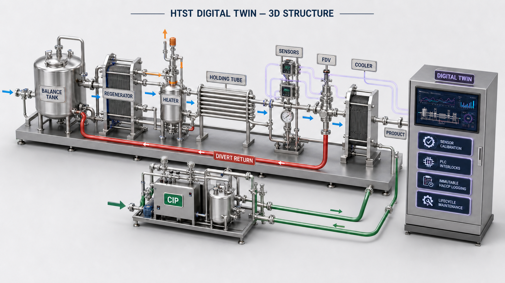
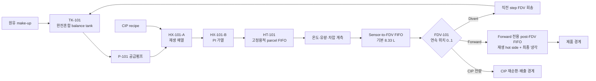
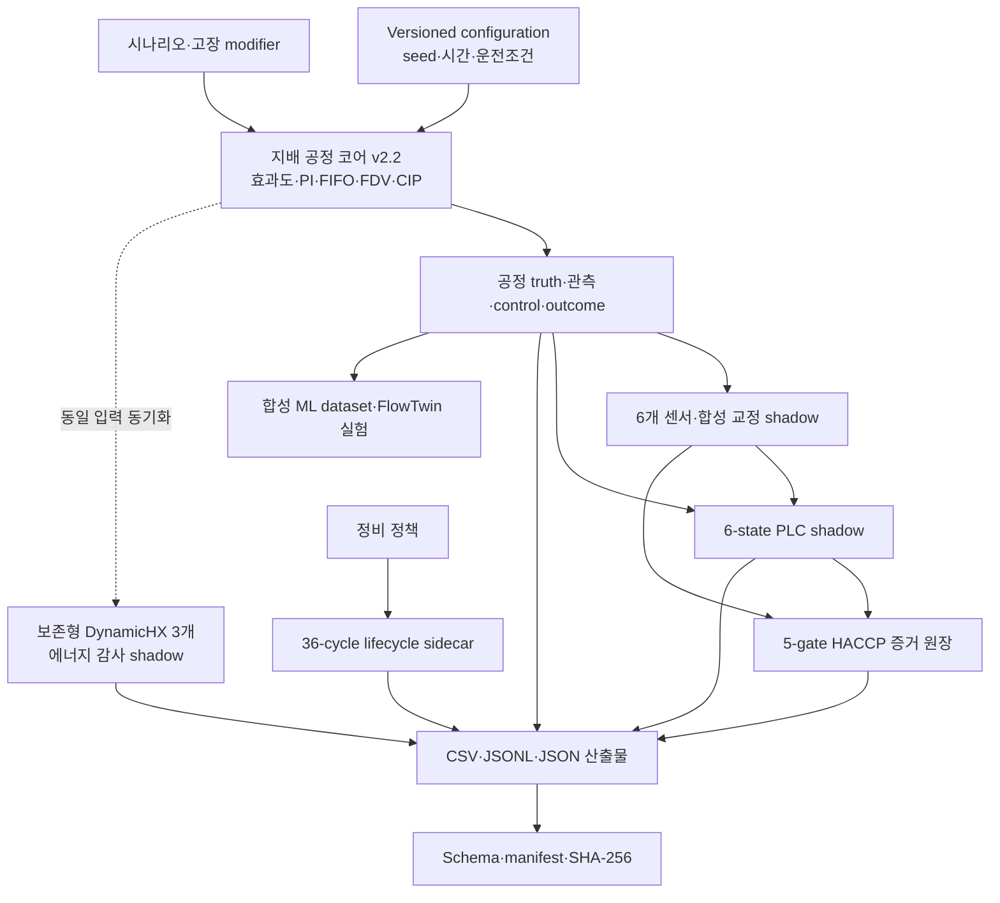
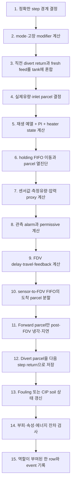

# 연속식 우유 HTST 식품 스마트 팩토리 연구용 시뮬레이터

> 공개 공정자료를 구조적 근거로 사용하고, 식별되지 않은 값은 공학 가정으로 분리하여 만든 재현 가능한 동적 연구용 surrogate였습니다.

이 저장소에서는 연속식 우유 HTST(high-temperature short-time) 공정의 원유 공급, 재생 예열, PI 가열, holding, 계측, flow-diversion valve(FDV), 회송, 후단 냉각, fouling, CIP, 재기동을 하나의 시간축으로 구현했습니다. 여기에 기계 판독형 참조 P&ID, 합성 센서 교정, shadow PLC, HACCP 증거 원장, 반복 정비 수명모델과 합성 ML 실험 파이프라인을 연결했습니다.

특정 공장의 실측값을 모사했다고 주장하지 않았습니다. 공개자료에서 확인할 수 있었던 **공정의 구조**와 **대표 운전 범위**만 옮겼고, 배관 용적·열전달계수·센서 오차·밸브 응답·세정 속도처럼 현장자료 없이는 정할 수 없었던 값은 versioned configuration의 공학 가정으로 명시했습니다. 따라서 이 프로젝트의 완성 범위는 “연구 가설을 반복 실행하고 소프트웨어 계약을 검증할 수 있는 시뮬레이터”까지였습니다.

| 항목 | 구현 상태 |
|---|---|
| 공정 코어 / 상태 schema | `2.2.0` / `1.0.0`으로 구현했습니다. |
| 통합 실행기 / 산출물 schema | `3.0.0` / `1.0.0`으로 구현했습니다. |
| FlowTwin benchmark protocol / runner | `0.2.0` / `0.3.0`으로 고정했습니다. |
| 코어 런타임 | Python 표준 라이브러리만 사용했습니다. |
| ML·전체 시험 환경 | `requirements-ml.txt`의 NumPy·PyTorch를 사용했습니다. |
| 자동시험 | ML 환경에서 `272개` 시험을 통과했습니다. |
| 공장·제품·규제 검증 | 수행하지 않았습니다. |
| 병원체·CFU·D-value·증식 모델 | 연구 범위에서 제외했습니다. |
| 실제 PLC 제어·제품 자동출하 | 수행하지 않도록 차단했습니다. |

> [!IMPORTANT]
> 코드의 `safe`, `unsafe`, 상대 열처리 지수, 오염위험, 세정완료, HACCP `HOLD`와 RUL은 모두 내부 가정에 따른 **합성 진단값**이었습니다. 실제 제품 출하·폐기, 살균 유효성, CCP 한계 설정, HACCP/법규 적합성, 설비 제어 또는 정비시점 결정에 사용할 수 없도록 범위를 제한했습니다.

## 목차

1. [무엇을 연구하기 위해 만들었는가](#1-무엇을-연구하기-위해-만들었는가)
2. [2D·3D 구조 이미지](#2-2d3d-구조-이미지)
3. [전체 시스템 구조](#3-전체-시스템-구조)
4. [외부자료를 어떻게 설계로 옮겼는가](#4-외부자료를-어떻게-설계로-옮겼는가)
5. [소프트웨어를 어떻게 구성했는가](#5-소프트웨어를-어떻게-구성했는가)
6. [공정 코어를 어떻게 계산했는가](#6-공정-코어를-어떻게-계산했는가)
7. [한 timestep에서 무엇을 계산했는가](#7-한-timestep에서-무엇을-계산했는가)
8. [CIP와 생산–세정–재기동을 어떻게 연결했는가](#8-cip와-생산세정재기동을-어떻게-연결했는가)
9. [스마트 팩토리 통합 계층을 어떻게 만들었는가](#9-스마트-팩토리-통합-계층을-어떻게-만들었는가)
10. [시나리오와 고장을 어떻게 주입했는가](#10-시나리오와-고장을-어떻게-주입했는가)
11. [실행 결과를 어떻게 저장하고 검증했는가](#11-실행-결과를-어떻게-저장하고-검증했는가)
12. [처음부터 어떻게 재현하는가](#12-처음부터-어떻게-재현하는가)
13. [현재 시뮬레이션 결과가 어떻게 나왔는가](#13-현재-시뮬레이션-결과가-어떻게-나왔는가)
14. [ML 실험을 어떻게 구성했는가](#14-ml-실험을-어떻게-구성했는가)
15. [자동시험으로 무엇을 확인했는가](#15-자동시험으로-무엇을-확인했는가)
16. [논문에서 주장할 수 있는 범위](#16-논문에서-주장할-수-있는-범위)
17. [현장 검증 전에 필요한 자료](#17-현장-검증-전에-필요한-자료)

## 1. 무엇을 연구하기 위해 만들었는가

이 시뮬레이터에서는 단순한 정상상태 온도 계산보다 다음 연구 질문을 먼저 다루도록 설계했습니다.

- 유량이 바뀌었을 때 holding tube의 실제 수송지연과 가장 빠른 유체의 보수적 체류시간이 어떻게 달라지는지 계산했습니다.
- 저온, 고유량, 압력차 부족, 센서 이상과 밸브 동작지연이 동시에 발생했을 때 실제 제품경계에 도달한 부적합 부피를 계산했습니다.
- FDV 회송액이 balance tank의 온도·통과횟수·위험·화학물질 상태에 어떻게 다시 섞이는지 추적했습니다.
- 생산, CIP와 재기동 사이에서 물리 상태를 초기화하지 않고 운반했을 때 세정 잔류물과 제품 interface가 어떻게 전파되는지 계산했습니다.
- 관측 가능한 센서·알람과 시뮬레이터만 아는 참상태를 분리하여 ML label leakage를 차단했습니다.
- 동일 seed·설정·소스에서 동일 결과를 얻고, 산출물 변조나 설정 불일치를 checksum과 manifest로 발견하도록 만들었습니다.

연구 대상을 다음 세 경계로 나눴습니다.

| 경계 | 포함한 내용 | 포함하지 않은 내용 |
|---|---|---|
| 공정 경계 | 열처리·수송·회송·냉각·압력 proxy·fouling·CIP를 포함했습니다. | CFD, 판별 유로, 실제 pump curve와 공간분포 열전달은 포함하지 않았습니다. |
| 자동화 경계 | 센서 chain, PI, permissive, 연속 FDV, shadow PLC와 HACCP 기록을 포함했습니다. | 실제 PLC/SIS 실행, vendor runtime, FAT/SAT와 전자서명은 포함하지 않았습니다. |
| 안전 경계 | 합성 조건 위반과 제품경계 부적합 부피를 계산했습니다. | 병원체 사멸, CFU, D/z 식별, challenge study와 법적 적합 판정은 포함하지 않았습니다. |

## 2. 2D·3D 구조 이미지

### 2.1 2D 공정·제어 구조


2D 그림에서는 제품 흐름을 파란색, 열원을 주황색, FDV 회송을 빨간색, CIP를 초록색, 센서·PLC·HACCP·수명 계층의 데이터 흐름을 보라색 점선으로 구분했습니다. 이 그림을 통해 holding 이후 계측 위치와 FDV 사이에 별도 지연 배관이 있고, 전진한 제품만 후단 재생·냉각 경로로 들어가도록 만든 이유를 표시했습니다.

### 2.2 3D 설비 배치 개념도



3D 그림에서는 balance tank, pump, 판형 열교환기, holding tube, FDV, CIP skid와 데이터 계층의 상대적인 배치 개념을 표현했습니다. 두 그림 모두 코드 구조를 설명하기 위한 연구용 개념도였으며, 실제 공장의 치수·설치좌표·배관경사·노즐 방향 또는 as-built P&ID로 사용하지 않았습니다.

기계 판독 가능한 연결정보는 [reference_pid.json](reference_pid.json)에 저장했고, 실행기가 검증한 전체 GitHub Mermaid 도면은 `digital_twin_results/reference_plant.md`로 생성하도록 구현했습니다.

## 3. 전체 시스템 구조

### 3.1 물질 흐름



공정 위상은 `원유 → balance tank → 재생 예열 → 가열 → holding → 계측 → sensor-to-FDV 배관 → FDV → 후단 재생·냉각 → 제품`으로 고정했습니다. 회송액은 직전 timestep의 유체 속성을 보존한 뒤 다음 timestep에 balance tank로 되돌렸습니다. CIP 유체는 생산 탱크와 분리된 재순환 경계로 보냈습니다.

### 3.2 계산 계층과 지배 관계



실제 공정의 온도와 routing을 결정한 **지배 plant**는 [model.py](model.py)의 효과도·PI·1차 지연·parcel FIFO 모델이었습니다. [process_components.py](process_components.py)의 `DynamicHeatExchanger` 3개는 같은 입력을 받아 에너지수지를 계산했지만, 그 출력은 PI·FDV·제품온도로 되먹이지 않았습니다.

센서 교정값과 [plc_logic.py](plc_logic.py)의 상태도 공정 코어를 구동하지 않았습니다. 공정 실행 후 평가하는 shadow 계층으로 만들었습니다. [lifecycle.py](lifecycle.py)는 960초 공정 trace와 동적으로 결합하지 않은 별도 36-cycle sidecar로 실행했습니다. 이 지배 관계를 명시하여 “shadow 수지가 닫혔다”는 사실을 “실제 설비의 온도가 검증됐다”는 주장으로 확대하지 않았습니다.

## 4. 외부자료를 어떻게 설계로 옮겼는가

공개자료는 수치 복사보다 **구조 선택의 근거**로 사용했습니다. 특정 논문의 장치 계수나 검증 결과를 현 가상설비에 그대로 전이하지 않았습니다. 출처별 접근일·상세 적용범위는 [SOURCES.md](SOURCES.md)에 기록했습니다.

| 외부자료 | 확인한 구조 | 구현에 반영한 부분 | 전이하지 않은 부분 |
|---|---|---|---|
| [Tetra Pak, Designing a process line](https://dairyprocessinghandbook.tetrapak.com/chapter/designing-process-line) | balance tank–재생–가열–holding–booster–FDV–냉각의 대표 HTST 순서를 확인했습니다. | `20,000 L/h`, `4°C` 원유·제품, `90%` 재생효과를 연구 기준점으로 선택했고 위상을 구성했습니다. | 실제 배관용적, 압력손실, 밸브 응답과 센서 사양은 가져오지 않았습니다. |
| [Tetra Pak, Heat exchangers](https://dairyprocessinghandbook.tetrapak.com/chapter/heat-exchangers) | 대표 HTST 범위와 holding의 fastest-flow 계수 개념을 확인했습니다. | `74°C`, 명목 `18 s`, 최소 `15 s`, fastest 계수 `0.85`를 연구점으로 사용했습니다. | 실제 RTD, 열교환기 형상·UA와 공장 성능은 전이하지 않았습니다. |
| [Tetra Pak, Tanks](https://dairyprocessinghandbook.tetrapak.com/chapter/tanks) | balance tank와 부적합 제품 회송 구조를 확인했습니다. | 회송액의 부피·온도·통과횟수·위험·화학분율 moment를 완전혼합했습니다. | 실제 level controller와 비이상 혼합은 식별하지 않았습니다. |
| [Tetra Pak, Cleaning of dairy equipment](https://dairyprocessinghandbook.tetrapak.com/chapter/cleaning-dairy-equipment) | 수세–알칼리–수세–산–최종수세의 구조와 시간·온도·농도·유속 영향을 확인했습니다. | protein/mineral soil, 약품 잔류와 conductivity/pH proxy를 구현했습니다. | 현장 SOP, 세정제 공급사 조건과 세정 유효성 기준은 복사하지 않았습니다. |
| [Gutierrez et al. (2014)](https://doi.org/10.1016/j.jfoodeng.2014.01.029) | 판형 pasteurizer의 transient 열상태와 수송상태를 분리할 필요를 확인했습니다. | 유체·벽체 저장에너지의 `DynamicHeatExchanger`와 holding transport state를 구성했습니다. | 논문의 장치 치수·계수·실험 검증 결과는 전이하지 않았습니다. |
| [Sharma & Macchietto (2021)](https://doi.org/10.1016/j.fbp.2020.12.005) | fouling–열수력–CIP를 반복 운전에 연결하는 구조를 확인했습니다. | scalar fouling, soil 제거와 lifecycle 연결의 구조적 근거로 사용했습니다. | 분포형 deposit model과 fitted kinetics는 구현하지 않았습니다. |
| [Zhang et al. (2026)](https://doi.org/10.1016/j.ces.2025.122395) | 온도·유속·화학조건에 따른 whey-protein soil 제거구조를 확인했습니다. | 잔존 soil 의존 세정 proxy를 구성했습니다. | 해당 실험의 plate geometry와 fitted rate는 가져오지 않았습니다. |
| [ISO 10628-1:2014](https://www.iso.org/standard/51840.html) | 공정도 구성과 표현 원칙을 참고했습니다. | JSON 위상과 Mermaid view를 구성했습니다. | ISO symbol 적합성이나 설계승인을 주장하지 않았습니다. |
| [IEC 61131-3:2025](https://webstore.iec.ch/en/publication/68533) | Structured Text의 표현형식을 참고했습니다. | vendor-neutral ST trace를 작성했습니다. | vendor compiler·task scheduling·safety integrity를 검증하지 않았습니다. |
| [NIST TN 1297](https://www.nist.gov/pml/nist-technical-note-1297) | 표준불확실성 RSS와 확장불확실성 표현을 확인했습니다. | `u_c = sqrt(sum(u_i²))`, `U = k·u_c`를 구현했습니다. | 추적 가능한 교정 certificate는 만들지 않았습니다. |
| [Kijima (1989)](https://doi.org/10.1017/S0021900200041826) | 불완전 수리 후 virtual-age 구조를 확인했습니다. | lifecycle의 `V_after = q·V_before` 구조에 사용했습니다. | Weibull·damage·repair 계수는 논문에서 복사하지 않았습니다. |

HACCP에서는 국내 고시, Codex와 FDA/NACMCF 자료의 위해분석–CCP–한계–모니터링–개선조치–검증–기록이라는 7원칙 구조만 참조했습니다. 코드의 온도·시간·유량·압력차 숫자를 관할 규정에 적합한 한계라고 선언하지 않았습니다. 관련 링크와 적용 경계는 [SOURCES.md](SOURCES.md)에 함께 기록했습니다.

### 4.1 공개자료와 공학 가정을 분리한 방법

각 값은 다음 세 등급으로 구분했습니다.

1. 공개자료에서 확인한 **공정 구조**는 P&ID·코드 위상에 반영했습니다.
2. 공개자료의 대표범위 안에서 선택한 **연구 기준점**은 configuration에 노출했습니다.
3. 현장자료 없이 정한 **공학 가정**은 source-derived 값처럼 표현하지 않고 변경 가능한 파라미터로 남겼습니다.

예를 들어 `20,000 L/h`, `74°C`, `18 s`, 재생효과 `0.90`은 공개된 대표 예시를 바탕으로 선택했습니다. 반면 FDV 이동 `0.20 s`, sensor-to-FDV 지연 `1.50 s`, 요구 압력차 `0.50 bar`, 배관손실과 센서잡음은 특정 공장의 자료가 아니라 내부적으로 일관된 가상설비 가정이었습니다.

## 5. 소프트웨어를 어떻게 구성했는가

저장소를 공정 코어, 연속 campaign, 통합 계층, ML, 검증으로 나눴습니다.

```text
htst_milk/
├── model.py                         # 지배 공정, 시나리오, FIFO, FDV, campaign state
├── process_components.py            # BalanceTank, DynamicHX, CIPSoilModel
├── run_scenarios.py                 # 21개 독립 시나리오와 원자적 산출물 발행
├── generate_report.py               # checksum 검증 후 표·그림 보고서 생성
├── uncertainty.py                   # Monte Carlo + OAT 민감도 분석
│
├── campaign_specs/
│   ├── complete_cip.json            # 생산→완전 CIP→재기동
│   └── incomplete_cip.json          # 생산→불완전 CIP→재기동
├── run_campaign.py                  # 물리 상태 carryover와 checkpoint 실행
│
├── reference_pid.json               # 61-tag 기계 판독형 참조 위상
├── reference_plant.py               # 위상·필수경로 검증과 Mermaid 생성
├── sensor_catalog.json              # 6개 센서의 동특성·교정 계약
├── sensor_calibration.py             # 합성 교정·불확실성·guard band
├── plc/cause_effect.json             # 12개 cause/effect 계약
├── plc/htst_reference.st             # vendor-neutral Structured Text 추적본
├── plc_logic.py                      # 6-state shadow PLC
├── haccp_plan.json                   # 5개 process gate와 기록 계약
├── haccp.py                          # fail-closed 평가와 SHA-256 증거사슬
├── maintenance_policy.json           # 4개 자산의 합성 정비정책
├── lifecycle.py                      # 반복 CIP·정비·virtual age sidecar
├── digital_twin_config.json          # 통합 reference run 설정
├── run_digital_twin.py               # 모든 계층을 묶는 v3 실행기
│
├── ml_contract.json                  # 20-class, feature·label·split 계약
├── ood_profile_contract.json         # 합성 OOD support 범위
├── generate_ml_dataset.py            # counterfactual episode 생성
├── split_ml_dataset.py               # profile-group 단위 분할
├── audit_ml_dataset.py               # 누수·범위·checksum 감사
├── flowtwin_guard/                   # graph·observer·hybrid·baseline·metrics
├── run_flowtwin_benchmark.py         # train→validation calibration→test firewall
├── flowtwin_benchmark_contract.json  # 16 variants × 3 seeds 동결 계약
├── flowtwin_v03_candidate_contract.json
│
├── d3_rul_contract.json              # 단일 생산구간 scalar-fouling RUL 계약
├── generate_d3_rul_dataset.py
├── generate_multicycle_rul_dataset.py
├── run_d3_rul_baselines.py
│
├── tests/                             # 물리·계약·CLI·ML 자동시험
├── docs/images/                       # GitHub 2D·3D 구조 이미지
├── docs/results/flowtwin-v03/         # Git에 공개한 소형 ML 결과표
├── SOURCES.md                         # 외부자료–코드 추적성
├── MODEL_CARD.md                      # 사용범위와 금지용도
├── ML_EXPERIMENTS.md                  # ML 실험 설계·해석
├── FLOWTWIN_GUARD.md                  # 제안모델과 전체 실행계약
└── checksums.sha256                   # 추적 파일 무결성 ledger
```

`digital_twin_results/`, `campaign_results/`, `uncertainty_results/`, `ml_datasets/`, `ml_results/`의 대용량 재생성 산출물은 Git에서 제외했습니다. GitHub에는 코드·계약·문서·대표 그림과 [소형 FlowTwin 결과표](docs/results/flowtwin-v03/README.md)를 공개했습니다. 아래의 명령을 실행하면 제외된 산출물을 로컬에서 다시 만들도록 구성했습니다.

## 6. 공정 코어를 어떻게 계산했는가

### 6.1 시간 적분과 설정 검증

기본 공정 실행을 `dt = 0.5 s`, `duration = 900 s`로 구성했습니다. 통합 reference run은 `dt = 1.0 s`를 사용했습니다. 허용한 시간간격은 `0.001 ≤ dt ≤ 1.0 s`였으며, 실행 전에 모든 설정의 유한성·부호·범위·상호관계와 최대 step·queue 크기를 검사했습니다.

고장 시작·종료, CIP phase와 전체 종료시각이 일반 timestep 내부에 있으면 그 경계에서 step을 분할했습니다. 이 방식으로 `300 s`에 시작하는 고장이 `299.5 s`나 `300.5 s`로 밀리는 문제와 마지막 partial step 누락을 막았습니다.

코어의 대표 기본값은 다음처럼 구성했습니다. 모든 값은 [model.py](model.py)의 `HTSTConfig`에서 변경할 수 있도록 했습니다.

| 구분 | 파라미터 | 기본값 |
|---|---|---:|
| 시간 | `duration_s / dt_s / random_seed` | `900 / 0.5 / 20260724` |
| 고장 | `fault_start_s / fault_duration_s / severity` | `300 / 120 / 1.0` |
| 유량 | `nominal_flow_l_h` | `20,000 L/h` |
| 온도 | 원유 / setpoint / diversion | `4 / 74 / 72°C` |
| 전진 | temperature margin | `0.30°C` |
| Holding | 명목 / 최소 / fastest factor | `18 s / 15 s / 0.85` |
| 제품 | 목표 / 내부 상한 | `4 / 6°C` |
| 물성 | 밀도 / 비열 | `1.03 kg/L / 3.90 kJ·kg⁻¹·K⁻¹` |
| Balance tank | 용량 / 초기 / 최소 | `1,200 / 600 / 50 L` |
| Balance tank | 주변 열완화 시정수 | `7,200 s` |
| 열모델 | 재생효과 / 재생 시정수 | `0.90 / 4 s` |
| 열모델 | heater 시정수 / 최대 상승 | `2 s / 82°C` |
| 열모델 | cooler 효과도 / 정지 시정수 | `0.98 / 3,600 s` |
| Utility | heating / cooling inlet | `120 / 1°C` |
| 수송 | sensor-to-FDV / post-FDV delay | `1.5 / 5 s` |
| FDV | 확인 / 회송지연 / 이동시간 | `1.0 / 0.20 / 0.20 s` |
| 압력 | raw / booster gain | `2.00 / 1.20 bar` |
| 압력 | line loss / fouling loss / 요구 차압 | `0.25 / 0.35 / 0.50 bar` |
| PI | `Kp / Ki` | `0.005 / 0.0002` |
| Fouling | 정상 성장률 / alarm | `0.04 h⁻¹ / 0.55` |
| CIP | 초기 fouling / protein / mineral | `0.65 / 650 g / 350 g` |
| CIP | line hold-up / clean soil threshold | `100 L / 300 g` |
| CIP | residual chemical threshold | `0.002` |
| Shadow HX | UA regenerator/heater/cooler | `40 / 50 / 45 kW·K⁻¹` |
| Shadow HX | 양측 holdup / wall capacity | `25 L each / 60 kJ·K⁻¹` |
| Shadow HX | 내부 최대 substep | `0.05 s` |

### 6.2 Balance tank와 회송

`BalanceTank`를 완전혼합 탱크로 구현했습니다. fresh raw stream과 직전 step의 divert return을 먼저 섞은 뒤, 공정 공급량과 목표수위를 유지할 make-up을 수지화했습니다. 각 속성 `x`는 단순 행 평균이 아니라 부피 moment로 운반했습니다.

```text
V_new        = V_old + V_fresh + V_return - V_out - V_overflow
M_x,new      = M_x,old + V_fresh·x_fresh + V_return·x_return - V_out·x_mixed
x_mixed      = M_x / V
```

온도, 평균 공정 통과횟수, 회송 오염위험, 잔류 화학물질과 제품분율에 같은 보존 원리를 적용했습니다. 탱크 overflow, 공급부족 또는 최소 운전재고 위반은 조용히 보정하지 않고 실행을 중단했습니다. 부피·온도 moment·위험·화학물질·제품분율의 step별 잔차와 전체 외부 부피수지를 기록했습니다.

### 6.3 재생 예열과 지배 열모델

PI와 제품온도를 실제로 움직인 지배 열모델은 계산비용을 제한한 reduced-order model이었습니다. 재생부 목표온도를 다음과 같이 계산했습니다.

```text
T_reg,target = T_in + ε_eff · (T_last_hold - T_in)
ε_eff        = ε_clean · scenario_factor · fouling_factor
T_reg,new    = T_reg,old + [1 - exp(-dt/τ_reg)] · (T_reg,target - T_reg,old)
```

기본 clean regeneration effectiveness를 `0.90`, 재생 시정수를 `4 s`로 설정했습니다. 무유량에서는 목표를 주변온도로 바꾸고 downstream parcel을 이동시키지 않은 채 열만 지수완화했습니다.

### 6.4 PI 가열제어

가열제어에는 feed-forward, PI, 출력 제한과 anti-windup을 넣었습니다.

```text
e            = T_set - T_control
u_ff         = (T_set - T_preheat) / ΔT_heater,max
u_raw        = u_ff + Kp·e + Ki·∫e dt
steam_valve  = clamp(u_raw, 0, 1)
```

기본 `Kp = 0.005`, `Ki = 0.0002`, 최대 가열상승 `82°C`를 사용했습니다. saturation 방향으로 오차가 더 쌓일 때 적분을 되돌려 windup을 제한했습니다. 전원 또는 유량이 없으면 steam valve를 `0`으로 만들었습니다.

가열기 목표와 실제 상태는 다음처럼 계산했습니다.

```text
capacity     = heater_factor · max(0.05, 1 - 0.45·fouling)
               · Q_nom / max(Q, 0.05·Q_nom)
T_heat,target= T_preheat + steam_valve · 82 · capacity
T_heat,new   = T_heat,old + [1 - exp(-dt/2)] · (T_heat,target - T_heat,old)
```

이 식은 제어와 고장실험을 위한 축약식이었으며, 증기압·응축·plate별 열전달을 계산한 first-principles model은 아니었습니다.

### 6.5 Holding tube와 parcel FIFO

Holding tube를 순수한 `N-step delay`가 아니라 고정용적 parcel FIFO로 만들었습니다. 기본 유량은 `20,000 L/h = 5.5556 L/s`, 명목 holding time은 `18 s`였으므로 holding volume을 `100 L`로 계산했습니다.

```text
V_holding = (20,000 / 3,600) L/s × 18 s = 100 L
```

각 parcel에는 다음 상태를 함께 저장했습니다.

- 부피와 온도를 저장했습니다.
- 유입 시작·종료시각을 저장했습니다.
- 평균 공정 통과횟수를 저장했습니다.
- 회송 위험, 화학물질과 제품분율을 저장했습니다.
- 압력 적합성, 열처리 진단과 후단 고장 metadata를 저장했습니다.

한 parcel의 일부만 빠져나갈 때 유입구간을 같은 비율로 잘랐고, 잘린 구간의 유입·유출 중간시각 차이로 체류시간을 계산했습니다. 따라서 timestep 크기만큼 residence time이 일률적으로 길어지는 편향을 줄였습니다.

평균 수송 체류시간에서 fastest-flow proxy와 무차원 상대 열처리 진단을 다음처럼 계산했습니다.

```text
t_fast = η_fast · t_mean
L_rel  = (t_fast / t_ref) · 10^((T - T_ref) / z)
```

기본값은 `η_fast = 0.85`, `T_ref = 72°C`, `t_ref = 15 s`, `z = 7°C`로 두었습니다. parcel의 내부 열처리 안전조건은 `T ≥ 72°C`, `t_fast ≥ 15 s`, `L_rel ≥ 1`을 모두 만족하도록 구성했습니다. 지수 폭주를 막기 위해 exponent를 유한범위로 제한하고 제한 횟수를 진단값으로 남겼습니다.

`L_rel`이라는 변수명이 열처리 상대지수를 나타내지만 특정 미생물의 lethality는 아니었습니다. 병원체, D-value, CFU 감소 또는 생존확률로 해석하지 않았습니다.

### 6.6 무유량과 정지 중 열이력

유량이 `0`이면 holding, sensor-to-FDV와 post-FDV queue의 parcel을 이동시키지 않았습니다. 각 parcel 온도만 다음 정확한 지수완화식으로 주변온도에 접근시켰습니다.

```text
T(t + dt) = T_ambient + [T(t) - T_ambient] · exp(-dt / τ_stationary)
```

기본 정지 열완화 시정수는 `3,600 s`였습니다. 이 구현으로 정전·정지 후 재기동할 때 기존 배관 재고의 열이력이 사라지지 않도록 했습니다.

### 6.7 Sensor-to-FDV 수송지연

holding 출구의 안전계측과 FDV가 같은 위치에 있다고 가정하지 않았습니다. 기본 sensor-to-FDV delay `1.5 s`를 명목 유량에서 `8.333 L`의 별도 parcel FIFO로 환산했습니다.

```text
V_sensor→FDV = 5.5556 L/s × 1.5 s = 8.333 L
```

이 queue 때문에 현재 센서가 안전하더라도 FDV에는 이전 시점의 parcel이 도착할 수 있었습니다. 전진 전에는 line flush와 연속 안전 확인을 `1 s` 동안 요구했습니다.

### 6.8 유량·압력·오염 proxy

측정유량에는 scenario bias와 Gaussian noise를 적용했습니다. 추정 체류시간은 측정유량에서 다시 계산했습니다.

```text
t_est          = V_holding / Q_measured
t_fast,est     = 0.85 · t_est
Q_safe,max     = V_holding · 0.85 / 15 s
               = 20,400 L/h
```

실제 유체망 대신 다음 hydraulic proxy를 사용했습니다. 여기서 `r = Q / Q_nom`이었습니다.

```text
P_raw  = 2.00 + 0.10·(r² - 1)                         [bar]
P_past = P_raw + 1.20·booster - 0.25·r² - 0.35·fouling [bar]
ΔP     = P_past - P_raw
```

전진 permissive에는 noisy sensor로 얻은 `ΔP_measured ≥ 0.50 bar`를 사용했습니다. 내부 오염위험 proxy는 `실제 leak > 0`과 `실제 ΔP < 0.50 bar`가 동시에 발생할 때만 켰습니다. 이 식은 pump curve, 배관망, plate 균열유동이나 미생물 이동을 해석하지 않았습니다.

### 6.9 관측 permissive

코어의 전진 permissive는 내부 truth를 직접 보지 않고 다음 관측조건을 모두 만족하도록 만들었습니다.

- 생산 mode이고 유량과 전원이 가용해야 했습니다.
- safety temperature가 `72.0 + 0.3 = 72.3°C` 이상이어야 했습니다.
- 측정유량에서 추정한 fastest residence가 `15 s` 이상이어야 했습니다.
- 측정유량이 `20,400 L/h` 이하여야 했습니다.
- 측정 pasteurized-to-raw 압력차가 `0.50 bar` 이상이어야 했습니다.
- 두 온도센서 차이가 `0.75°C` 이하여야 했습니다.
- leak, sensor-dropout alarm이 없어야 했습니다.
- campaign 재기동 중에는 CIP release relay도 참이어야 했습니다.

제품의 고온 alarm은 이미 FDV를 지난 후단 품질상태이므로 upstream 전진 permissive에 넣지 않았습니다.

### 6.10 연속 위치 FDV

FDV를 즉시 바뀌는 Boolean switch로 구현하지 않았습니다. 실제 위치를 `0..1`로 두고 기본 회송 actuation delay `0.20 s`, 양방향 travel `0.20 s`, position feedback와 mismatch timer를 계산했습니다. stuck-forward, slow travel, feedback bias와 minimum leakage opening을 고장 modifier로 주입했습니다.

한 timestep 안에서 밸브가 움직였으면 시작·종료 위치의 사다리꼴 적분으로 forward fraction을 구했습니다. 해당 부피구간만 parcel slice에서 잘라 forward로 보내고 나머지는 divert했습니다. 따라서 permissive가 닫힌 step에서도 밸브가 이동하는 동안 소량이 전진할 수 있었습니다.

### 6.11 전진 전용 후단 FIFO와 제품경계

FDV를 통과한 forward parcel만 재생 hot side와 final cooler의 효과를 적용한 뒤 post-FDV FIFO로 넣었습니다. 기본 후단 체류 `5 s`를 `27.778 L`의 고정재고로 환산했습니다.

```text
V_post-FDV = 5.5556 L/s × 5 s = 27.778 L
```

냉각 고장이 발생한 시각과 제품경계에서 품질이 나빠지는 시각을 같게 만들지 않았습니다. 고장상태와 계산한 제품온도를 parcel metadata에 붙이고, 후단 수송지연이 지난 뒤 제품경계에 도달시켰습니다. `unsafe_forward_event`도 FDV 명령시각이 아니라 실제 제품경계의 `unsafe_forward_l > 0`으로 정의했습니다.

### 6.12 Fouling과 보존형 열교환기 shadow

생산 중 scalar fouling을 다음 축약식으로 증가시켰습니다.

```text
heat_factor = clamp((T_process - 55) / 19, 0, 2)
Δfouling    = (0.04 h⁻¹ / 3,600) · dt · scenario_factor
              · max(flow_ratio, 0) · heat_factor
```

fouling은 지배 plant의 재생효과·가열능력과 압력손실에 영향을 주었습니다. 동시에 regenerator, heater, cooler에 각각 `DynamicHeatExchanger` shadow를 실행했습니다. 기본 UA는 `40/50/45 kW/K`, 양측 유체 holdup은 각 `25 L`, wall heat capacity는 `60 kJ/K`, 내부 substep은 최대 `0.05 s`로 구성했습니다. shadow는 유체 bulk·벽체 저장에너지, UA/fouling resistance와 주변 열손실을 계산해 step 에너지 잔차를 출력했습니다.

이 세 열교환기의 온도와 UA는 지배 plant에 feedback하지 않았습니다. 따라서 에너지수지 시험은 **shadow component 방정식의 보존성**만 확인했으며 실제 공정 전체의 열수지 검증을 의미하지 않았습니다.

또한 [reference_pid.json](reference_pid.json)에 기록한 line holdup은 위상과 검증용 구조정보였습니다. 모든 P&ID line holdup을 [model.py](model.py)의 동적 재고로 직접 사용하지는 않았습니다. 동적 재고로 계산한 구간은 holding, sensor-to-FDV, post-FDV, balance tank와 회송 stream이었습니다.

## 7. 한 timestep에서 무엇을 계산했는가

한 step의 논리적 계산순서를 다음처럼 고정했습니다.



1. 종료·고장·phase 경계를 넘지 않는 `step_dt`를 계산했습니다.
2. seed로 고정한 scenario modifier와 plant mode를 결정했습니다.
3. 생산 중에는 직전 step 회송액을 balance tank에 넣고 목표수위 make-up을 계산했습니다. CIP 중에는 생산 탱크를 격리했습니다.
4. 실제유량과 공급 parcel의 온도·통과횟수·위험·화학·제품분율을 결정했습니다.
5. 지배 재생부, PI steam valve와 가열부 상태를 갱신했습니다. 같은 입력으로 shadow heat exchanger도 별도 계산했습니다.
6. 가열 출구 parcel을 holding FIFO에 넣고 같은 부피를 출구에서 잘라 체류시간·상대 열처리 진단을 계산했습니다.
7. 센서 noise/bias/dropout, 측정유량, 실제·측정압력과 leak signal을 계산했습니다.
8. 생산 CCP alarm을 계산했고 CIP mode에서는 해당 alarm을 억제했습니다. 관측값으로 전진 permissive를 만들었습니다.
9. FDV 확인부피, actuation delay, travel과 feedback mismatch를 계산했습니다.
10. sensor-to-FDV FIFO 출구 parcel을 step 내부의 밸브 위치구간에 따라 forward/divert로 분할했습니다.
11. forward parcel만 후단 재생·냉각과 post-FDV FIFO를 거쳐 제품경계로 내보냈습니다.
12. divert parcel은 속성을 보존한 pending return으로 저장해 다음 step에 투입했습니다.
13. 생산에서는 fouling을 성장시켰고, CIP에서는 protein/mineral soil과 약품 잔류를 갱신했습니다.
14. inventory, 부피, 온도·위험·화학·제품 moment와 shadow 에너지 잔차를 검사했습니다.
15. truth·observable·control·context·oracle·outcome 역할을 붙인 시계열 row와 alarm edge를 기록했습니다.

## 8. CIP와 생산–세정–재기동을 어떻게 연결했는가

### 8.1 CIP recipe와 soil 모델

기본 CIP를 다음 여섯 단계로 구성했습니다.

| 시간 | mode | 설정 proxy |
|---:|---|---|
| `0–60 s` | `CIP_PRE_RINSE` | 예비수세를 수행했습니다. |
| `60–240 s` | `CIP_CAUSTIC` | `2%` alkali, `75°C` setpoint를 사용했습니다. |
| `240–300 s` | `CIP_INTERMEDIATE_RINSE` | 중간수세를 수행했습니다. |
| `300–420 s` | `CIP_ACID` | `1%` acid, `65°C` setpoint를 사용했습니다. |
| `420–540 s` | `CIP_FINAL_RINSE` | 최종수세를 수행했습니다. |
| `540 s 이후` | `CIP_COMPLETE` | 유량을 정지했습니다. |

초기 soil을 protein `650 g`, mineral `350 g`으로 분리했습니다. Alkali 단계는 protein, acid 단계는 mineral을 주로 제거하도록 했고, 제거속도에 온도·농도·유속(`velocity^0.8`) factor를 곱했습니다. 배관의 alkali/acid 잔류는 `100 L` 완전혼합 hold-up의 displacement로 계산했습니다.

```text
displacement_fraction = 1 - exp(-Q·dt / V_line)
conductivity_proxy    = 0.2 + 65·alkali + 45·acid
pH_proxy              = 7 + 5·tanh(80·alkali) - 4·tanh(80·acid)
```

`cip_cleaning_complete`는 총 soil이 `300 g` 이하이고 residual chemical fraction이 `0.002` 이하일 때만 참이 되도록 했습니다. 이 kinetics와 threshold는 합성 공학 가정이었습니다. biofilm, ATP, swab, 미생물 사멸, 실제 전도도 endpoint나 세정 validation을 대신하지 않았습니다.

### 8.2 일반 시나리오와 campaign을 분리한 이유

`run_scenarios.py`에서는 시나리오마다 simulator를 새로 만들어 독립적인 비교가 가능하도록 했습니다. 반면 `run_campaign.py`에서는 생산→CIP→재기동의 물리적 연속성을 유지했습니다.

Campaign phase 사이에 다음 상태를 carry했습니다.

- RNG와 전역 campaign clock을 carry했습니다.
- balance tank의 부피·온도·통과횟수·위험·화학·제품 moment와 pending return을 carry했습니다.
- holding, sensor-to-FDV, post-FDV의 세 parcel FIFO를 carry했습니다.
- FDV 실제 위치와 feedback·timer를 carry했습니다.
- 지배 preheat/heater 상태와 세 shadow heat exchanger의 bulk/wall 온도를 carry했습니다.
- fouling, protein/mineral soil, alkali/acid 잔류와 interface 상태를 carry했습니다.

Phase 경계에서는 PI integral과 permissive 확인 memory만 reset했습니다. CIP 진입 시 FDV에 divert를 명령했지만 위치를 순간이동시키지 않았습니다. 생산 balance tank는 CIP 유로에서 격리했지만 주변 열교환은 계속 계산했습니다.

재기동에서는 holding의 chemical/product interface signal과 제품경계 parcel의 화학분율·제품분율·온도가 모두 기준을 만족할 때까지 once-through transition drain으로 보냈습니다. Versioned JSON checkpoint에는 상태 hash를 넣었고, 중단 후 import해 재개한 결과가 무중단 실행과 같도록 시험했습니다.

## 9. 스마트 팩토리 통합 계층을 어떻게 만들었는가

### 9.1 기계 판독형 참조 P&ID

[reference_pid.json](reference_pid.json)에 `61 tags`, `22 nodes`, `23 lines`, `16 instruments`, `8 actuators`, `26 I/O`를 정의했습니다. Node는 boundary 7개, equipment 7개, actuator 8개로 나눴습니다. [reference_plant.py](reference_plant.py)에서 모든 line endpoint와 actuator 연결을 검사하고 다음 6개 필수경로를 graph traversal로 검증했습니다.

- `RAW_TO_PRODUCT`를 검증했습니다.
- `FDV_DIVERT_RETURN`을 검증했습니다.
- `CIP_RECIRCULATION`을 검증했습니다.
- `CIP_DRAIN`을 검증했습니다.
- `CIP_ALKALI_DOSING`을 검증했습니다.
- `CIP_ACID_DOSING`을 검증했습니다.

검증된 JSON에서 GitHub용 Mermaid를 자동 생성했습니다. 이 P&ID는 공개자료 위상을 코드와 연결한 참조 계약이었으며 ISO-conforming engineering drawing이나 as-built 도면은 아니었습니다.

### 9.2 센서 동특성·교정·불확실성

[sensor_catalog.json](sensor_catalog.json)에 `TT-104`, `FT-101`, `PDT-101`, `AIT-201`, `AIT-202`, `AIT-203`의 6개 센서를 정의했습니다. 각 raw signal에 다음 순서를 적용했습니다.

```text
plant truth
 → 1차 lag
 → gain/offset
 → 선형 drift
 → 방향성 hysteresis
 → Gaussian noise
 → quantization
 → dropout 시 hold-last-value
```

합성 3-point as-found/as-left 데이터를 OLS로 적합하고 inverse correction을 계산했습니다. 불확실성 성분은 RSS로 결합한 뒤 기본 coverage factor `k = 2`로 확장했습니다. calibration validity, lower/upper guard band와 expiry를 검사했고 overlap·결측·만료는 `UNKNOWN/HOLD`로 보냈습니다.

이 교정기록은 실제 표준기·certificate·traceability chain을 갖지 않은 합성 reference였습니다. 보정값은 governing plant로 feedback하지 않고 shadow PLC/HACCP의 평가용으로만 사용했습니다. AIT 보정값으로 코어 CIP relay를 다시 계산하지 않았으며, HACCP 계층에서는 코어 release signal과 calibration status를 함께 평가했습니다.

### 9.3 Shadow PLC와 cause/effect

[plc_logic.py](plc_logic.py)에 `OFF`, `STARTUP`, `RECIRCULATE`, `FORWARD`, `CIP`, `TRIP`의 6-state deterministic state machine을 구현했습니다. [plc/cause_effect.json](plc/cause_effect.json)에는 12개 cause/effect를 만들었습니다.

- E-stop, power, sensor quality, FDV mismatch, leak의 5개 원인은 latching `TRIP`으로 만들었습니다.
- Low temperature, low holding time, high flow, low differential pressure, sensor disagreement, CIP active와 CIP not released의 7개 원인은 non-latching `DIVERT`로 만들었습니다.

[plc/htst_reference.st](plc/htst_reference.st)의 marker와 JSON cause/effect를 1:1로 검사했습니다. PLC scan time은 통합 기본값 `1 s`로 설정했습니다. 이 PLC는 simulator actuator를 구동하지 않았으며 코어 명령과 shadow 명령의 일치 여부만 기록했습니다. 실제 vendor runtime, I/O forcing, watchdog, safety PLC와 scan jitter는 구현하지 않았습니다.

### 9.4 HACCP 증거 원장

[haccp_plan.json](haccp_plan.json)과 [haccp.py](haccp.py)에 다음 5개 process gate를 구성했습니다.

1. 보정된 안전온도가 `72.3°C` 이상인지 평가했습니다.
2. fastest residence가 `15 s` 이상인지 평가했습니다.
3. 유량이 해당 row의 maximum safe flow 이하인지 평가했습니다.
4. 차압이 `0.50 bar` 이상인지 평가했습니다.
5. 생산 재개 전에 CIP release가 참인지 평가했습니다.

값이 없거나 비유한 경우, 교정이 만료됐거나 판정할 수 없는 경우에는 fail-closed로 `UNKNOWN/HOLD`를 기록했습니다. 한 번 설정한 lot `HOLD`는 뒤의 정상 row 하나로 자동 해제하지 않는 sticky 상태로 만들었습니다. 각 record를 canonical JSON으로 직렬화해 직전 hash와 연결한 SHA-256 append-only internal chain을 만들었습니다.

전자서명, 관할 적합성 평가, 실제 corrective action과 자동출하는 구현하지 않았습니다. 기본 설정에서 `automatic_release=false`로 고정했습니다.

### 9.5 반복 정비와 lifecycle sidecar

[maintenance_policy.json](maintenance_policy.json)과 [lifecycle.py](lifecycle.py)에 4개 자산, 36개 생산/CIP cycle, cycle당 `16 h`의 합성 수명모델을 만들었습니다. 상태를 reversible fouling, irreversible damage와 virtual age로 분리했습니다.

```text
V_after_repair = q · V_before
```

Weibull virtual-age hazard, 선형 damage와 fouling-limit를 competing event로 계산했습니다. Complete/incomplete CIP가 fouling을 기본 `92%/55%` 제거하고 damage를 추가하도록 했습니다. 예정 calibration·repair·overhaul·replacement와 마지막 interval의 right-censoring을 기록했습니다. Conditional median RUL은 앞으로 같은 생산부하가 계속된다는 조건으로 계산했고 향후 예정 CIP·정비를 미리 반영하지 않았습니다.

이 sidecar는 960초 공정 trace와 상태를 주고받지 않았습니다. 현장 정비이력으로 계수를 적합하지도 않았습니다. 일부 policy asset ID(`HX-101`, `XV-101`, `TT-102B`)는 참조 P&ID의 세부 tag(`HX-101-A…D`, `FDV-101`, `TT-104`)와 일치하지 않는 legacy/aggregate identifier이므로 직접적인 tag-to-tag 결합을 주장하지 않았습니다.

### 9.6 통합 실행 순서

`run_digital_twin.py`에서는 다음 순서로 계층을 결합했습니다.

1. JSON 설정을 strict schema와 version으로 검증했습니다.
2. 참조 P&ID와 필수경로를 검증하고 Mermaid를 생성했습니다.
3. 공정 코어에서 `120 s 생산 → 600 s complete CIP → 240 s 재기동`을 실행했습니다.
4. 동일 trace에서 6개 센서 raw/corrected 값을 생성했습니다.
5. 센서와 코어 relay를 1초 shadow PLC scan에 공급했습니다.
6. 보정상태·PLC·공정값을 HACCP 5-gate evidence로 변환했습니다.
7. 같은 seed와 별도 정책으로 36-cycle lifecycle sidecar를 실행했습니다.
8. 모든 artifact를 staging directory에 쓴 뒤 manifest와 checksum이 완성됐을 때만 목표 디렉터리로 교체했습니다.

## 10. 시나리오와 고장을 어떻게 주입했는가

Standalone simulator에는 21개 이름을 등록했습니다. `sensor_bias_high`가 `control_sensor_bias_high`의 호환 alias였으므로 ML taxonomy는 `N00`, `M01`, `M02`, `F01`–`F17`의 20개 canonical class로 만들었습니다.

| Simulator 이름 | ML class | 주입한 변화 |
|---|---|---|
| `normal` | `N00` | 정상 생산 기준선을 만들었습니다. |
| `start_stop` | `M01` | 유량·가열·booster 정지와 재기동을 만들었습니다. |
| `cip_cycle` | `M02` | 정상 6단계 CIP를 실행했습니다. |
| `steam_loss` | `F01` | 가열능력을 감소시켰습니다. |
| `flow_surge` | `F02` | 실제 유량을 증가시켰습니다. |
| `sensor_bias_high` | `F03` alias | control bias의 호환 이름으로 유지했습니다. |
| `control_sensor_bias_high` | `F03` | control 온도센서에 양의 step bias를 넣었습니다. |
| `safety_sensor_bias_high` | `F04` | safety 온도센서에 양의 step bias를 넣었습니다. |
| `dual_sensor_common_bias` | `F05` | 두 온도센서에 공통 bias를 넣었습니다. |
| `flowmeter_bias_low_with_surge` | `F06` | 실제 surge와 표시유량 음의 bias를 함께 넣었습니다. |
| `booster_pump_failure` | `F07` | booster 성능을 낮췄습니다. |
| `regenerator_leak_pressure_inversion` | `F08` | booster 저하·누설·압력역전 proxy를 함께 넣었습니다. |
| `progressive_fouling` | `F09` | fouling 증가율을 가속했습니다. |
| `valve_stuck_forward_steam_loss` | `F10` | 저온과 stuck-forward를 함께 넣었습니다. |
| `cooling_utility_loss` | `F11` | 후단 냉각성능을 감소시켰습니다. |
| `incomplete_cleaning` | `F12` | CIP 제거효율을 낮췄습니다. |
| `power_failure` | `F13` | 유량·가열·booster를 정지시키고 fail-divert를 적용했습니다. |
| `sensor_drift` | `F14` | control 온도센서에 ramp bias를 넣었습니다. |
| `sensor_dropout` | `F15` | 세 온도신호를 hold-last-value로 만들고 dropout을 기록했습니다. |
| `slow_valve` | `F16` | FDV 이동을 늦추고 가열능력도 함께 낮췄습니다. |
| `valve_leakage` | `F17` | 회송 중 최소 forward 개도와 가열능력 저하를 함께 넣었습니다. |

Standalone 기본 고장구간은 `300–420 s`, 기본 severity는 `1.0`으로 설정했습니다. Severity는 고장마다 서로 다른 물리 modifier에 매핑했으므로, 같은 숫자를 동일 고장크기나 실제 발생빈도로 비교하지 않았습니다. 통합 기본 실행은 `normal → complete CIP → normal`만 수행했고, 17개 fault는 `run_scenarios.py` 또는 ML generator에서 별도로 실행했습니다.

## 11. 실행 결과를 어떻게 저장하고 검증했는가

### 11.1 필드 역할과 ML leakage 방지

Standalone schema의 `202 fields`와 campaign schema의 `209 fields`에 다음 역할 중 하나를 빠짐없이 부여했습니다.

| 역할 | 의미 | 사용정책 |
|---|---|---|
| `observable_signal` | 설치 가능한 계측을 표현했습니다. | 센서 가용성을 확인한 뒤 ML 입력 후보로 허용했습니다. |
| `observable_alarm` | 관측값으로 만든 PLC형 alarm을 표현했습니다. | alarm-aware 실험에서만 입력하도록 했습니다. |
| `control` | 명령과 actuator 상태를 표현했습니다. | 실험계약에 따라 입력으로 사용했습니다. |
| `context` | 시간·mode·episode·seed·hash를 표현했습니다. | 조인·분할·평가에 사용했습니다. |
| `oracle` | 참상태·주입고장·내부 safety 진단을 표현했습니다. | 온라인 ML 입력에서 금지했습니다. |
| `outcome` | 누적량과 실제 routing 결과를 표현했습니다. | label·평가에만 사용했습니다. |

`alarm_count`에는 관측 alarm만 포함했습니다. 참 parcel safety와 숨은 fouling을 사용하는 `alarm_unsafe_forward`, `alarm_high_fouling`은 각각 diagnostic/oracle count로 분리했습니다. `power_good_signal`과 `temperature_sensor_quality_ok`는 설치 가능한 PLC interface를 표현했지만 현재 합성 구현에서는 내부 truth를 결정적으로 mirror했으므로, status-aware 결과와 sensor-only ablation을 분리하도록 계약했습니다.

### 11.2 원자적 발행과 provenance

각 실행기는 목표 디렉터리에 바로 쓰지 않았습니다. 임시 staging directory에서 모든 파일을 완성하고, row 수·schema·manifest·checksum을 확인한 뒤 하나의 디렉터리 교체로 발행했습니다. 실패한 실행이 이전 정상결과를 일부 덮어쓰거나 오래된 파일을 남기지 않도록 했습니다.

`run_manifest.json`에는 다음 정보를 저장했습니다.

- model·schema·runner version을 저장했습니다.
- seed, canonical configuration과 SHA-256을 저장했습니다.
- Python version과 실제 재현 명령을 저장했습니다.
- 실행에 사용한 source file별 SHA-256을 저장했습니다.
- artifact 이름과 row count를 저장했습니다.

`checksums.sha256`에는 artifact별 hash를 기록했습니다. `generate_report.py`는 checksum, manifest/summary identity, config hash와 CSV 재계산 KPI가 일치하지 않으면 보고서 생성을 거부하도록 했습니다.

### 11.3 통합 실행이 만든 산출물

통합 실행은 다음 19개 payload와 별도 `checksums.sha256` ledger를 만들었습니다.

| 산출물 | 내용 |
|---|---|
| `config_snapshot.json` | 실제 사용한 canonical 설정을 저장했습니다. |
| `reference_plant_snapshot.json` | 검증된 P&ID graph를 저장했습니다. |
| `reference_plant.md` | GitHub Mermaid 참조 P&ID를 생성했습니다. |
| `process_trace.csv`, `process_events.csv` | 공정 row와 alarm/mode edge를 저장했습니다. |
| `timeseries.csv` | 공정·PLC·HACCP 결합 축약 시계열을 저장했습니다. |
| `sensor_trace.csv` | 6개 센서의 raw·corrected·status를 저장했습니다. |
| `calibration_records.json`, `calibration_summary.csv` | 합성 교정과 불확실성 결과를 저장했습니다. |
| `plc_trace.csv`, `plc_events.csv` | shadow scan과 state transition을 저장했습니다. |
| `haccp_evidence.jsonl`, `haccp_deviations.csv` | hash-chain evidence와 deviation을 저장했습니다. |
| `lifecycle_trace.csv`, `lifecycle_events.csv` | 36-cycle 자산상태와 정비 event를 저장했습니다. |
| `service_intervals.csv` | failure/right-censor interval을 저장했습니다. |
| `digital_twin_summary.json` | 핵심 KPI와 한계를 저장했습니다. |
| `schema.json` | 모든 artifact field·role 계약을 저장했습니다. |
| `run_manifest.json` | version·source·config·artifact provenance를 저장했습니다. |

## 12. 처음부터 어떻게 재현하는가

모든 명령은 이 저장소 루트에서 실행하도록 작성했습니다.

### 12.1 환경 준비와 전체 시험

공정 시뮬레이터 자체는 Python 표준 라이브러리만으로 실행되도록 만들었습니다. 다만 전체 `tests/`에는 ML 모듈 시험이 포함됐으므로 NumPy·PyTorch 환경을 먼저 만들었습니다.

```bash
python3.12 -m venv .venv
.venv/bin/pip install -r requirements-ml.txt
.venv/bin/python -m unittest discover -s tests -v
```

확인한 환경에서는 `272 tests / OK`가 나왔습니다. 일반 `python3`에 PyTorch가 없다면 전체 test discovery가 ML import 단계에서 실패하므로, 코어의 표준 라이브러리 실행과 전체 test 환경을 구분했습니다.

### 12.2 통합 reference run

```bash
python3 run_digital_twin.py \
  --config digital_twin_config.json \
  --output digital_twin_results
```

기본 설정은 `dt=1 s`, `120 s 생산 + 600 s CIP + 240 s 재기동 = 960 s`를 실행했습니다. 별도 lifecycle은 `36 cycles × 16 h = 576 h`를 계산했습니다.

### 12.3 21개 독립 시나리오

```bash
python3 run_scenarios.py
```

특정 시나리오를 동일 조건으로 실행하려면 다음 명령을 사용했습니다.

```bash
python3 run_scenarios.py \
  --scenarios normal steam_loss start_stop sensor_dropout valve_leakage \
  --duration 900 \
  --dt 0.5 \
  --seed 20260724 \
  --fault-start 300 \
  --fault-duration 120 \
  --severity 1.0 \
  --output results_v2

python3 generate_report.py --results-dir results_v2
```

`run_scenarios.py`는 scenario CSV 21개와 event log, summary, schema, manifest의 총 25개 checksum payload를 만들었습니다. `generate_report.py`가 뒤에 추가한 `REPORT.md`와 PNG는 원 scenario ledger와 별도 후처리 산출물이었습니다.

### 12.4 생산→CIP→재기동 campaign

```bash
python3 run_campaign.py \
  --spec campaign_specs/complete_cip.json \
  --output campaign_results/complete_cip

python3 run_campaign.py \
  --spec campaign_specs/incomplete_cip.json \
  --output campaign_results/incomplete_cip
```

각 campaign은 `1,020 s`, `2,040 rows`를 생성했습니다. Campaign CSV, event·transition log, canonical spec, phase checkpoint, 초기·최종 state, summary, schema, manifest와 checksum을 발행했습니다.

### 12.5 저장된 불확실성 분석의 정확한 재현

```bash
python3 uncertainty.py \
  --runs 30 \
  --duration 900 \
  --dt 0.5 \
  --master-seed 20260724 \
  --scenarios steam_loss flow_surge dual_sensor_common_bias \
    booster_pump_failure progressive_fouling \
    valve_stuck_forward_steam_loss cooling_utility_loss \
    power_failure start_stop incomplete_cleaning sensor_drift \
    sensor_dropout slow_valve valve_leakage \
  --output uncertainty_results
```

이 설계에서는 주 시나리오 `14 × 30 = 420회`, mode-matched reference `60회`, 27변수 OAT `770회`를 합쳐 총 `1,250 simulator runs`를 실행했습니다. Monte Carlo parameter draw, paired reference, OAT 결과, source hash와 checksum을 함께 저장했습니다.

### 12.6 저장소 checksum 검증

macOS에서는 다음 명령으로 Git에 포함한 payload의 checksum을 검증했습니다.

```bash
shasum -a 256 -c checksums.sha256
```

README 개정 시점에 자기 자신을 제외한 `101/101` 항목이 통과하도록 갱신했습니다.

## 13. 현재 시뮬레이션 결과가 어떻게 나왔는가

아래 수치는 고정된 seed와 합성 설정에서 얻은 결정론적 회귀결과였습니다. 실제 공장의 발생확률이나 성능보증으로 해석하지 않았습니다. 대용량 실행 디렉터리는 Git에서 제외했으므로 명령으로 로컬 재생성하도록 했습니다.

### 13.1 통합 reference run

`digital_twin_config.json` 기본 실행에서 다음 결과를 확인했습니다.

| 항목 | 결과 | 해석 |
|---|---:|---|
| 공정시간 / row | `960 s / 960` | 1초 scan으로 생산·CIP·재기동을 실행했습니다. |
| 제품경계 forward | `1,191.111 L` | transition drain 이후 제품경계로 간 합성 부피였습니다. |
| unsafe / quality OOS | `0 / 0 L` | 이 정상+complete-CIP 설정에서는 내부 조건 위반이 없었습니다. |
| transition drain | `155.556 L` | 재기동 interface 기준 충족 전 배출한 부피였습니다. |
| final fouling / soil | `0.159999 / 246.153 g` | 합성 CIP soil model의 종료상태였습니다. |
| 센서 | `6개 / 5,760 rows` | 960 step × 6 sensor를 기록했습니다. |
| Shadow PLC | `960 scans`, core command match `937 scans` | PLC가 코어를 제어하지 않고 비교만 했습니다. |
| HACCP evidence | `12,448 records`, chain valid | 자동출하를 꺼서 lot status는 `HOLD`였습니다. |
| Lifecycle | `157 events`, `17 intervals`, failure `0` | 36-cycle sidecar의 마지막 interval은 모두 right-censored였습니다. |

HACCP에서 `PASS`, `DEVIATION`, `UNKNOWN`, `NOT_APPLICABLE`을 모두 기록했지만 lot을 자동으로 `RELEASE`하지 않았습니다. Lifecycle의 failure `0`도 설비가 고장 나지 않는다는 뜻이 아니라, 해당 합성 576시간과 정책에서는 고장 event 전에 예정정비 또는 censoring이 발생했다는 뜻이었습니다.

### 13.2 Complete CIP와 incomplete CIP 비교

동일한 `120 s 생산 → 600 s CIP → 300 s 재기동` 조건에서 CIP 효과만 바꿨습니다.

| 결과 | Complete CIP | Incomplete CIP |
|---|---:|---:|
| CIP 종료 soil | `241.315 g` | `353.990 g` |
| 재기동 종료 soil | `247.220 g` | `359.829 g` |
| 재기동 최대 forward 제품온도 | `4.699°C` | `4.713°C` |
| Chemical / dilution OOS | `0 / 0 L` | `0 / 0 L` |
| Hygiene OOS | `0 L` | `1,508.333 L` |
| 통합 quality OOS | `0 L` | `1,508.333 L` |
| Unsafe forward | `0 L` | `1,508.333 L` |
| 총 forward | `1,524.444 L` | `1,524.444 L` |
| Transition drain / addition | `158.333 / 161.111 L` | `158.333 / 161.111 L` |

Incomplete CIP 결과가 나빠진 원인은 온도나 약품잔류가 아니라, 내부 clean threshold보다 많은 surface-soil proxy를 재기동 parcel의 `hygiene-risk fraction`으로 전달했기 때문이었습니다. 이 비교는 state carryover와 label propagation이 의도대로 작동했다는 결정적 software example이었으며 실제 hygiene·미생물 위해량이나 세정 유효성 증거는 아니었습니다.

### 13.3 고장 시나리오의 제품경계 결과

기본 900초 저장 결과 중 제품경계 위반이 0이 아니었던 항목을 정리했습니다.

| 시나리오 | Forward | Unsafe forward | Quality OOS | Contamination-exposed |
|---|---:|---:|---:|---:|
| `flow_surge` | `4,113.611 L` | `88.333 L` | `0 L` | `0 L` |
| `dual_sensor_common_bias` | `4,662.778 L` | `318.333 L` | `0 L` | `0 L` |
| `flowmeter_bias_low_with_surge` | `4,352.028 L` | `311.472 L` | `0 L` | `0 L` |
| `booster_pump_failure` | `4,112.778 L` | `1.667 L` | `0 L` | `0 L` |
| `regenerator_leak_pressure_inversion` | `4,112.778 L` | `1.667 L` | `0 L` | `1.667 L` |
| `valve_stuck_forward_steam_loss` | `4,673.889 L` | `557.222 L` | `0 L` | `0 L` |
| `cooling_utility_loss` | `4,792.222 L` | `0 L` | `666.667 L` | `0 L` |
| `slow_valve` | `4,043.889 L` | `0.156 L` | `0 L` | `0 L` |
| `valve_leakage` | `4,157.807 L` | `44.537 L` | `0 L` | `0 L` |

Booster failure와 pressure-inversion에서 `1.667 L`가 남은 이유는 permissive가 닫혀도 FDV가 `0.20 s` 동안 연속적으로 이동했기 때문이었습니다. Cooling loss는 열처리 안전보다 후단 제품온도 품질조건을 위반했으므로 unsafe와 quality OOS를 별도로 기록했습니다. 이 결과를 실제 사고량·고장빈도나 검증된 보호계층 성능으로 해석하지 않았습니다.

## 14. ML 실험을 어떻게 구성했는가

### 14.1 데이터 계약

ML 입력에서는 `oracle`과 `outcome`을 차단하고, profile 단위 domain randomization과 counterfactual group을 사용했습니다. 같은 physical profile과 seed에서 normal/mode/fault episode를 묶어 비교하도록 만들었습니다. Profile group 전체를 train, validation, test 중 하나에만 넣어 동일 설비 파라미터가 split을 가로지르지 않도록 했습니다.

| Dataset | 구성 | Split·감사 상태 |
|---|---|---|
| `D1-pilot` | ID 12 profiles, 60 groups, 1,200 episodes, signal/label 각 4,320,000 rows였습니다. | 감사 `30/30`을 통과했지만 저장본 generator가 `2.2.0`, 현재 generator가 `2.2.1`이므로 현재 코드 재생성을 byte-identical reproduction이라고 부르지 않았습니다. |
| `D2-ood-dev` | ID 12 + OOD 4 profiles, 48 groups, 960 episodes, signal/label 각 1,728,000 rows였습니다. | train `7/420`, validation `2/120`, test-ID `3/180`, test-OOD `4/240` profiles/episodes로 분리했고 감사 `30/30`을 통과했습니다. |

D2의 OOD는 low-flow 2 profiles와 high-flow/warm-feed 2 profiles로 구성했습니다. Auditor가 이름만 믿지 않고 33개 physical parameter, profile config hash, versioned range와 ID/OOD 사이 strict support gap을 검사했습니다. 이는 합성 support shift의 무결성만 확인했으며 현장 OOD를 대표한다고 주장하지 않았습니다.

<details>
<summary><strong>D2 dataset·split·감사·cache 재현 명령</strong></summary>

```bash
python3 generate_ml_dataset.py \
  --output ml_datasets/D2-ood-dev \
  --dataset-version D2-ood-dev \
  --profiles 12 \
  --ood-profiles 4 \
  --ood-contract ood_profile_contract.json \
  --replicates 3 \
  --duration-s 900 \
  --dt-s 0.5 \
  --seed 20260731

python3 split_ml_dataset.py \
  --dataset ml_datasets/D2-ood-dev \
  --output ml_datasets/D2-ood-dev-splits \
  --seed 20260731 \
  --train-ratio 0.60 \
  --validation-ratio 0.20

python3 audit_ml_dataset.py \
  --dataset ml_datasets/D2-ood-dev \
  --splits ml_datasets/D2-ood-dev-splits \
  --report ml_results/D2-ood-dev-audit.json

.venv/bin/python build_flowtwin_cache.py \
  --dataset ml_datasets/D2-ood-dev \
  --splits ml_datasets/D2-ood-dev-splits \
  --output ml_datasets/D2-ood-dev-cache-v0.3 \
  --feature-set S3-context
```

</details>

### 14.2 FlowTwin 계열을 어떻게 만들었는가

공정 P&ID의 인과 연결을 graph allowlist로 고정하고, 관측 node만 입력으로 허용했습니다. Holding과 배관지연에는 fractional causal delay를 적용했고, FDV command가 아니라 실제 feedback으로 forward/divert route를 gating했습니다. Observer residual, temporal encoder, graph message passing, hierarchical 20-class diagnosis와 OOD/conformal head를 결합했습니다.

Benchmark registry는 FlowTwin-Guard 1개, neural baseline 6개, ablation 9개의 `16 variants × 3 seeds`로 고정했습니다. DSPR은 저자코드의 exact reproduction이 아니라 논문 식을 현재 causal HTST 진단계약에 맞춘 독립 adaptation으로 표시했습니다.

Train에서는 label을 사용해 event onset/middle/end가 loss-owning window에 포함되도록 했습니다. Validation-ID에서만 class temperature, anomaly threshold, conformal과 operational alarm point를 정했습니다. Test label은 calibration에 사용하지 않았습니다. 자세한 graph, loss, ablation과 명령은 [FLOWTWIN_GUARD.md](FLOWTWIN_GUARD.md)에 기록했습니다.

### 14.3 공개한 FlowTwin v0.3 개발 결과

아래 결과는 D2 test를 이미 확인한 뒤 선택한 `window=96`, seed `20260727`의 **post-hoc development-only** 결과였습니다. 따라서 독립 confirmatory 결과나 모델 우월성 근거로 사용하지 않았습니다. GitHub에 공개한 원표는 [docs/results/flowtwin-v03](docs/results/flowtwin-v03/README.md)에 checksum과 함께 저장했습니다.

| 모델 | Parameter | 전체 / ID / OOD macro-F1 | Row event-F1 | OOD AUROC | Validation alarm feasible |
|---|---:|---:|---:|---:|---:|
| FlowTwin-Hybrid v0.3 | `58,315` | `0.56218 / 0.68129 / 0.53188` | `0.03452` | `0.55268` | `4 / 75` |
| FlowTwin-Guard | `42,508` | `0.42491 / 0.55566 / 0.37698` | `0.02686` | `0.76773` | `4 / 75` |
| TCN | `15,379` | `0.58313 / 0.64073 / 0.54890` | `0.02222` | `0.45451` | `0 / 75` |
| DSPR adaptation | `54,166` | `0.59399 / 0.61125 / 0.58642` | `0.31215` | `0.57475` | `8 / 75` |

Hybrid은 ID macro-F1만 가장 높았습니다. DSPR은 전체·OOD macro-F1과 row event-F1이 더 높았고, FlowTwin-Guard는 OOD AUROC가 가장 높았지만 false-positive rate가 매우 높았습니다. 따라서 전반적 우월성은 없었습니다.

Validation alarm gate를 통과한 세 모델의 조건부 operational 결과는 다음과 같았습니다.

| 모델 | Event-F1 | Recall | Pooled false alarm `/h` | 최대 profile false alarm `/h` | 탐지 전 unsafe volume |
|---|---:|---:|---:|---:|---:|
| FlowTwin-Hybrid v0.3 | `0.87690` | `0.91092` | `5.744` | `9.421` | `436.18 L` |
| FlowTwin-Guard | `0.90040` | `0.97414` | `7.770` | `9.093` | `10.51 L` |
| DSPR adaptation | `0.88438` | `0.81322` | `3.276` | `4.178` | `3,674.27 L` |

TCN은 validation grid `75개` 중 recall·profile recall·profile false-alarm 제약을 동시에 만족한 점이 `0개`였으므로 test operational 값을 만들지 않았습니다. `F05` recall은 네 모델 모두 `0`, Hybrid의 `F09` recall도 `0`이었습니다. Conformal singleton `DIAGNOSE`도 네 모델 모두 `0`이었습니다. 실행시간은 병렬 CPU 경합을 포함했으므로 비교하지 않고 parameter count만 보고했습니다.

현재 결과에서 방어 가능한 결론은 다음과 같았습니다.

- 공정 graph와 수송제약을 넣은 모델이 ID 일부 지표에서 가능성을 보였습니다.
- class 성능, OOD, false alarm과 unsafe-volume 사이 trade-off가 컸습니다.
- 합성 test를 이미 연 뒤 후보를 고른 post-hoc 결과였으므로 새 봉인 profile에서 confirmatory 평가가 필요했습니다.
- 현장 일반화, novelty 우월성, 안전성·살균·HACCP 성능은 입증하지 못했습니다.

## 15. 자동시험으로 무엇을 확인했는가

전체 자동시험에서는 다음 소프트웨어 속성을 확인했습니다.

- Config 경계, 비유한 입력 거부와 bounded exponential을 확인했습니다.
- Seed 결정성, 정확한 event boundary와 timestep 수렴을 확인했습니다.
- 21개 시나리오의 유한 출력과 고장계약을 확인했습니다.
- Holding, sensor-to-FDV, post-FDV의 고정재고와 partial parcel routing을 확인했습니다.
- Balance tank의 외부부피·온도·통과횟수·위험·화학·제품 moment 보존을 확인했습니다.
- 무유량 열완화와 후단 고장전파 지연을 확인했습니다.
- 연속 FDV 이동·부분 routing·leakage floor·feedback mismatch를 확인했습니다.
- CIP soil 제거, 잔류 chemical과 incomplete cleaning의 분리를 확인했습니다.
- 생산→CIP→재기동의 RNG·FIFO·물리상태 carryover와 checkpoint 재개를 확인했습니다.
- 세 `DynamicHeatExchanger` shadow의 step 에너지보존과 fouling 영향을 확인했습니다.
- Observable alarm과 oracle 분리, CLI·manifest·checksum·원자적 발행을 확인했습니다.
- P&ID 6개 필수경로, 12개 PLC cause/effect, 6개 센서 교정과 HACCP hash chain을 확인했습니다.
- Lifecycle의 competing event, 정비, right-censor와 deterministic RUL을 확인했습니다.
- D1/D2 profile split, domain hash, support gap과 누수 감사 `30/30`을 확인했습니다.
- FlowTwin graph allowlist, fractional delay gradient, route gating, causal forward와 validation-only calibration을 확인했습니다.

시험 통과는 구현 계약과 회귀 불변식이 유지됐다는 뜻이었습니다. 실제 공정의 예측오차, 센서 정확도, 열분포, 살균효과, 세정효과 또는 안전무결성을 검증했다는 뜻은 아니었습니다.

## 16. 논문에서 주장할 수 있는 범위

현재 코드와 결과만으로는 다음처럼 제한된 주장을 할 수 있었습니다.

| 주장 후보 | 현재 근거 | 주장 수준 |
|---|---|---|
| 수송·FDV·회송을 부피보존 parcel로 결합했습니다. | FIFO·부분 slice·수지 자동시험과 scenario 결과를 보유했습니다. | 합성 simulator 방법론으로 주장할 수 있었습니다. |
| 생산–CIP–재기동의 상태연속성을 구현했습니다. | Versioned checkpoint와 complete/incomplete campaign 비교를 보유했습니다. | Software architecture 기여로 주장할 수 있었습니다. |
| 관측값·oracle·outcome을 분리했습니다. | 202/209-field role schema와 leakage audit를 보유했습니다. | 합성 ML 실험설계 기여로 주장할 수 있었습니다. |
| P&ID–sensor–PLC–HACCP evidence를 기계 판독형으로 연결했습니다. | JSON graph·cause/effect·calibration·hash-chain artifact를 보유했습니다. | Traceability prototype으로 주장할 수 있었습니다. |
| FlowTwin 계열이 모든 baseline보다 우수했습니다. | 현재 결과에서 전체·OOD·운영 우월성이 없었습니다. | 주장할 수 없었습니다. |
| 실제 HTST 공정을 정확히 모사했습니다. | 현장 P&ID·historian·교정·RTD 자료가 없었습니다. | 주장할 수 없었습니다. |
| 제품의 살균·세정·HACCP 적합성을 입증했습니다. | 생물학·challenge·현장 검증을 제외했습니다. | 주장할 수 없었습니다. |

논문용 novelty·가설·비교군·ablation·publication gate는 [NOVELTY_EVALUATION.md](NOVELTY_EVALUATION.md)에, 모델별 세부 실험계약은 [ML_EXPERIMENTS.md](ML_EXPERIMENTS.md)와 [FLOWTWIN_GUARD.md](FLOWTWIN_GUARD.md)에 기록했습니다.

## 17. 현장 검증 전에 필요한 자료

특정 공장에 맞는 digital twin으로 발전시키려면 다음 자료가 필요했습니다.

- 승인된 as-built P&ID, 배관별 내경·길이·용적과 밸브 위치가 필요했습니다.
- 열교환기 plate 형상, section별 UA, fouling 상태와 utility 경계조건이 필요했습니다.
- Pump curve, valve `Cv`, 압력계 위치와 정상·고장 hydraulic test가 필요했습니다.
- Tracer test 기반 RTD와 fastest-flow residence가 필요했습니다.
- Sensor raw historian, sampling/lag, 실제 calibration certificate와 uncertainty budget이 필요했습니다.
- PLC source, scan/task 설정, I/O mapping, cause/effect, FAT/SAT와 FDV 응답시험이 필요했습니다.
- 제품별 밀도·비열·점도와 온도 의존 물성이 필요했습니다.
- Soil load, CIP 유량·온도·농도·전도도·pH와 endpoint 검증자료가 필요했습니다.
- 반복 생산/CIP/정비 이력, failure mode, censoring과 교체기록이 필요했습니다.
- 독립된 현장 train/validation/test 기간과 drift monitoring 계획이 필요했습니다.

병원체·CFU·D-value·재오염·유통기한 모델은 이 저장소의 범위에서 계속 제외했습니다. 향후 해당 안전주장을 하려면 별도 생물학적 연구설계, 제품별 challenge data, 공인 시험과 전문가·관할 검토가 필요했습니다.

이 프로젝트의 최종 위치는 **공개자료 구조를 바탕으로 공학 가정과 참상태를 투명하게 노출하고, 공정 수송·제어·세정·증거·ML 실험을 결정적으로 재현한 연구용 simulator**였습니다. 상세 가정은 [MODEL_CARD.md](MODEL_CARD.md), 외부자료–코드 연결은 [SOURCES.md](SOURCES.md), 단일 생산구간 RUL 계약은 [D3_RUL.md](D3_RUL.md)에 기록했습니다.
